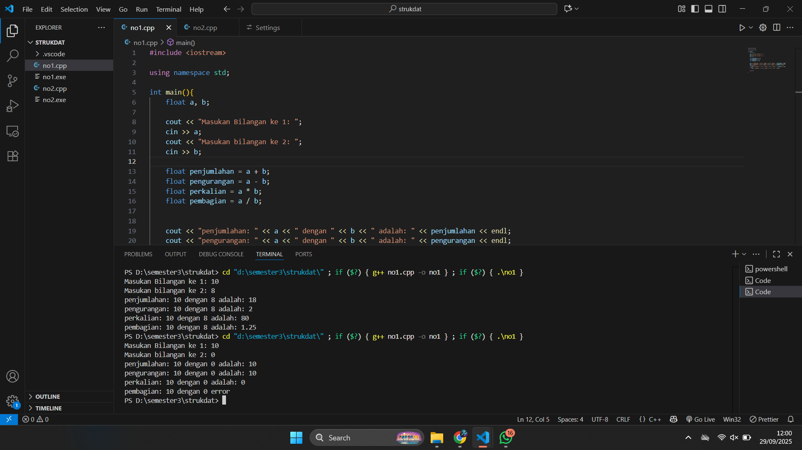
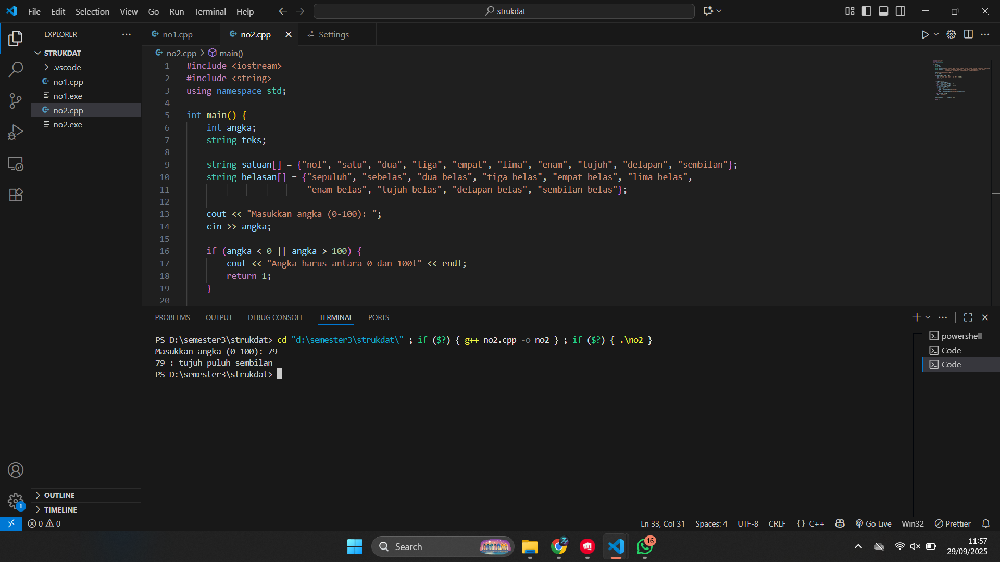
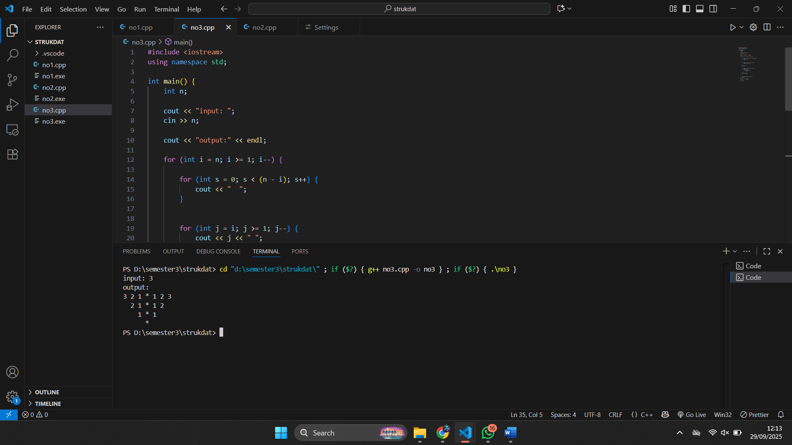

# <h1 align="center">Laporan Praktikum Modul 1 <br> Pengenalan c++</h1>
<p align="center">Zaki Hamdani - 103112400089</p>

## Dasar Teori

Dalam C++ ada beberapa dasar penting yang biasa dipelajari, yaitu struct, aritmatika, kondisi, perulangan, dan fungsi. Struct dipakai buat ngumpulin beberapa variabel dengan tipe berbeda dalam satu wadah supaya data lebih gampang diatur. Aritmatika berhubungan sama operator kayak +, -, *, /, dan % buat ngelakuin hitungan matematis. Kondisi atau percabangan (if, else if, else, switch) dipakai biar program bisa milih jalannya sesuai syarat yang ada. Perulangan (for, while, do while) berguna buat ngejalanin kode berulang-ulang tanpa harus nulis perintah banyak kali. Sementara itu, fungsi adalah blok kode yang bisa dipanggil kapan aja buat tugas tertentu, jadi program lebih rapi, gampang dibaca, dan bisa dipakai lagi.

## Unguided

### Soal 1

Buatlah program yang menerima input-an dua buah bilangan betipe float, kemudian memberikan output-an hasil penjumlahan, pengurangan, perkalian, dan pembagian dari dua bilangan tersebut

```go
#include <iostream>

using namespace std;

int main(){
    float a;
    float b;

    cout << "Masukan Bilangan ke 1: ";
    cin >> a;
    cout << "Masukan bilangan ke 2: ";
    cin >> b;
    
    float penjumlahan = a + b;
    float pengurangan = a - b;
    float perkalian = a * b;
    float pembagian = a / b;

    cout << "penjumlahan: " << a << " dengan " << b << " adalah: " << penjumlahan << endl;
    cout << "pengurangan: " << a << " dengan " << b << " adalah: " << pengurangan << endl;
    cout << "perkalian: " << a << " dengan " << b << " adalah: " << perkalian << endl;
    cout << "pembagian: " << a << " dengan " << b << " adalah: " << pembagian << endl;

    return 0;

}
```

> Output
> 

Penjelasan Kode
Program di atas meminta pengguna memasukkan dua bilangan, lalu menghitung penjumlahan, pengurangan, perkalian, dan pembagiannya. Hasil dari setiap operasi ditampilkan ke layar menggunakan cout, dan return 0; menandakan program selesai dengan normal.

### Soal 2

Buatlah sebuah program yang menerima masukan angka dan mengeluarkan output nilai angka tersebut dalam bentuk tulisan. Angka yang akan di-input-kan user adalah bilangan bulat positif mulai dari 0 s.d 100

```go
#include <iostream>
#include <string>
using namespace std;

int main() {
    int angka;
    string teks;
    
    string satuan[] = {"nol", "satu", "dua", "tiga", "empat", "lima", "enam", "tujuh", "delapan", "sembilan"};
    string belasan[] = {"sepuluh", "sebelas", "dua belas", "tiga belas", "empat belas", "lima belas", 
                        "enam belas", "tujuh belas", "delapan belas", "sembilan belas"};
    
    cout << "Masukkan angka (0-100): ";
    cin >> angka;
    
    if (angka < 0 || angka > 100) {
        cout << "Angka harus antara 0 dan 100!" << endl;
        return 1;
    }
    
    if (angka < 10) {
        teks = satuan[angka];
    } else if (angka >= 10 && angka < 20) {
        teks = belasan[angka - 10];
    } else if (angka >= 20 && angka < 100) {
        int puluhan = angka / 10;
        int sisa = angka % 10;
        if (sisa == 0) {
            teks = satuan[puluhan] + " puluh";
        } else {
            teks = satuan[puluhan] + " puluh " + satuan[sisa];
        }
    } else if (angka == 100) {
        teks = "seratus";
    }
    
    cout << angka << " : " << teks << endl;
    
    return 0;
}
```

> Output
> 

Program di atas digunakan untuk mengubah angka menjadi tulisan dalam bahasa Indonesia untuk rentang 0–100. Pertama, pengguna diminta memasukkan angka, lalu program mengecek apakah angka valid. Jika kurang dari 10, hasil diambil dari array satuan, jika 10–19 diambil dari array belasan, jika 20–99 dibentuk dari kata “puluh” ditambah satuan, dan khusus angka 100 ditampilkan sebagai “seratus”. Hasil akhirnya ditampilkan ke layar dalam bentuk angka dan teks.

### soal 3

aku mengerjakan perulangan

## Unguided

### Soal 3

Buatlah program yang dapat memberikan input dan output sbb.

```go
#include <iostream>
using namespace std;

int main() {
    int n;
    
    cout << "input: ";
    cin >> n;
    
    cout << "output:" << endl;
    
    for (int i = n; i >= 1; i--) {
        
        for (int s = 0; s < (n - i); s++) {
            cout << "  ";
        }
        
        
        for (int j = i; j >= 1; j--) {
            cout << j << " ";
        }
        
        cout << "* ";
        
        
        for (int j = 1; j <= i; j++) {
            cout << j;
            if (j < i) {
                cout << " ";
            }
        }
        cout << endl;
    }
    
    
    for (int s = 0; s < n; s++) {
        cout << "  ";
    }
    cout << "*" << endl;
    
    return 0;
}
```

> Output
> 

Program di atas meminta input sebuah angka `n`, lalu menampilkan pola berbentuk segitiga menurun dengan angka dari besar ke kecil di sebelah kiri, tanda `*` di tengah, dan angka dari kecil ke besar di sebelah kanan. Setiap baris bergeser ke kanan dengan spasi sesuai urutan, dan di bagian akhir program menambahkan satu `*` di bawah tengah pola.

## Referensi

1. https://en.wikipedia.org/wiki/Data_structure (diakses blablabla)


