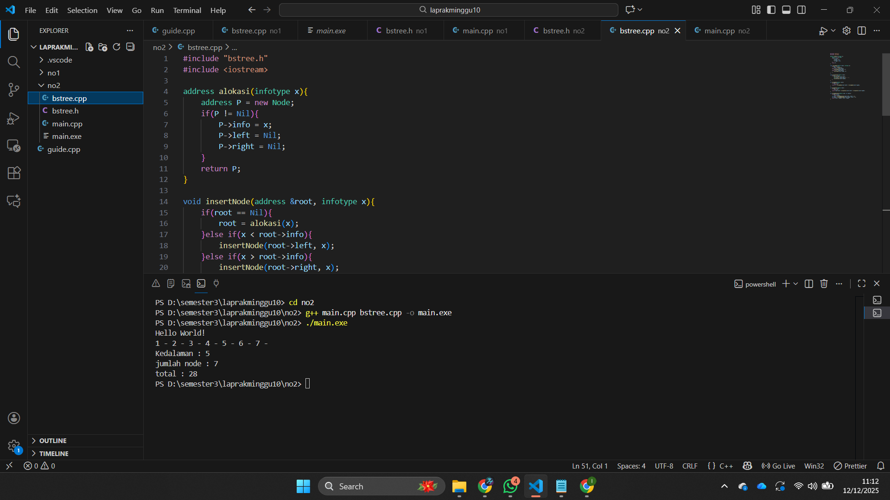
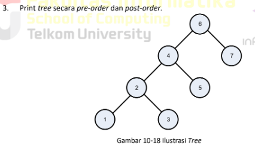
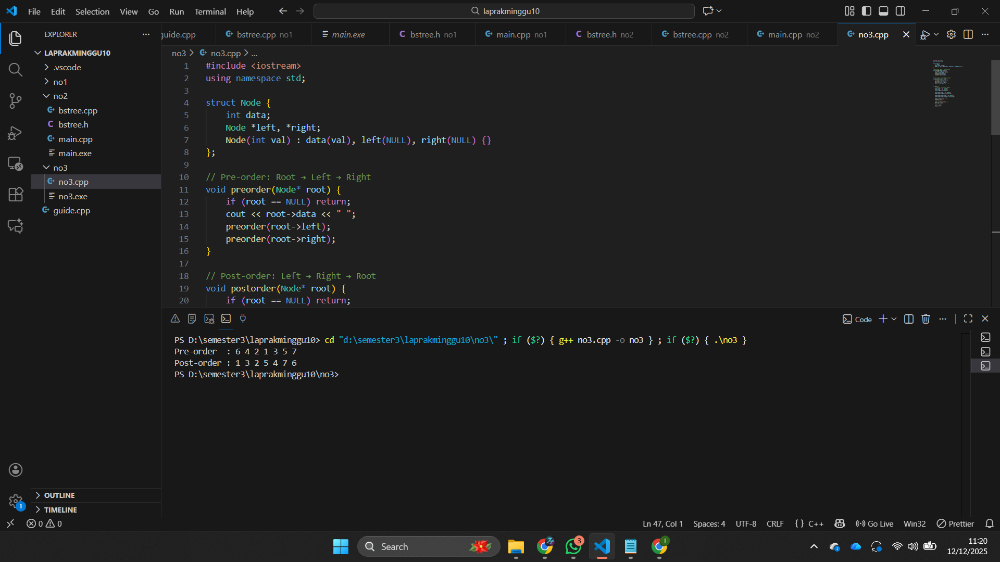

# <h1 align="center">Laporan Praktikum Modul 10 <br> Tree </h1>
<p align="center">Zaki Hamdani - 103112400089</p>

## Dasar Teori

Rekursif adalah teknik pemrograman di mana suatu fungsi memanggil dirinya sendiri untuk menyelesaikan masalah yang dapat dipecah menjadi bagian-bagian yang lebih kecil dan memiliki pola penyelesaian serupa. Setiap fungsi rekursif harus memiliki *base case* sebagai kondisi berhenti dan *recursive case* sebagai proses pemanggilan ulang fungsi. Meskipun rekursif dapat membuat algoritma lebih ringkas dan mudah dipahami, teknik ini kurang efisien dibanding iteratif karena membutuhkan memori tambahan untuk menyimpan *activation record* pada setiap pemanggilan fungsi. Konsep rekursif banyak digunakan pada berbagai struktur data, termasuk tree, yang merupakan struktur data non-linear berbentuk hirarki dengan simpul akar, simpul anak, dan simpul daun. Pada tree, rekursif mempermudah implementasi berbagai operasi seperti traversal, pencarian, penyisipan, dan penghapusan node.


## Guide

```go
#include <iostream>
using namespace std;

struct Node
{
    int data;
    Node *kiri, *kanan;
};

Node *buatNode(int nilai)
{
    Node *baru = new Node();
    baru->data = nilai;
    baru->kiri = baru->kanan = NULL;
    return baru;
}

Node *insert(Node *root, int nilai)
{
    if (root == NULL)
        return buatNode(nilai);
    
    if (nilai < root->data)
        root->kiri = insert(root->kiri, nilai);
    else if (nilai > root->data)
        root->kanan = insert(root->kanan, nilai);

    return root;
}

Node *search(Node *root, int nilai)
{
    if (root == NULL || root->data == nilai)
        return root;

    if (nilai < root->data)
        return search(root->kiri, nilai);

    return search(root->kanan, nilai);
}

Node *nilaiTerkecil(Node *node)
{
    Node *current = node;
    while (current && current->kiri != NULL)
        current = current->kiri;

        return current;
}

Node *hapus(Node *root, int nilai)
{
    if (root == NULL)
        return root;

    if (nilai < root->data)
        root->kiri = hapus(root->kiri, nilai);
    else if (nilai > root->data)
        root->kanan = hapus(root->kanan, nilai);
    else
    {
        if (root->kiri == NULL)
        {
            Node *temp = root->kanan;
            delete root;
            return temp;
        }
        else if (root->kanan == NULL){
            Node *temp = root->kiri;
            delete root;
            return temp;
        }
        Node *temp = nilaiTerkecil(root->kanan);
        root->data = temp->data;
        root->kanan = hapus(root->kanan, temp->data);
    }
    return root;
}

Node *update(Node *root, int Lama, int baru)
{
    if (search(root, Lama) != NULL)
    {
        root = hapus(root, Lama);
        root = insert(root, baru);
        cout << "Data " << Lama << " diupdate menjadi " << baru << endl;
    }
    else
    {
        cout << "Data " << Lama << " tidak ditemukan!" << endl;
    }
    return root;
}

void preOrder(Node *root)
{
    if (root != NULL)
    {
        cout << root->data << " ";
        preOrder(root->kiri);
        preOrder(root->kanan);
    }
}

void inOrder(Node *root)
{
    if (root != NULL)
    {
        inOrder(root->kiri);
        cout << root->data << " ";
        inOrder(root->kanan);
    }
}

void postOrder(Node *root)
{
    if (root != NULL)
    {
        postOrder(root->kiri);
        postOrder(root->kanan);
        cout << root->data << " ";
    }
}

int main()
{
    Node *root = NULL;

    cout << "=== 1. INSERT DATA ===" << endl;
    root = insert(root, 10);
    insert(root, 5);
    insert(root, 20);
    insert(root, 3);
    insert(root, 7);
    insert(root, 15);
    insert(root, 25);
    cout << "Data berhasil dimasukan.\n" << endl;

    cout << "=== 2. TAMPILKAN TREE (TRAVELSAL) ===" << endl;
    cout << "PreOrder : ";
    preOrder(root);
    cout << endl;
    cout << "InOrder : ";
    inOrder(root);
    cout << endl;
    cout << "PostOrder : ";
    postOrder(root);
    cout << "\n" << endl;

    cout << "=== 3. TEST SEARCH ===" << endl;
    int cari1 = 7, cari2 = 99;
    cout << "Cari " << cari1 << ": " << (search(root,cari1) ? "Ketemu" : "Tidak Aada") << endl;
    cout << "Cari " << cari2 << ": " << (search(root,cari2) ? "Ketemu" : "Tidak Aada") << endl;
    cout << endl;

    cout << "=== 4. TEST UPDATE ===" << endl;
    root = update(root, 5, 8);
    cout << "Hasil Order setelah update: ";
    cout << endl;
    cout << endl;

    cout << "PreOrder : ";
    preOrder(root);
    cout << endl;
    cout << "InOrder : ";
    inOrder(root);
    cout << endl;
    cout << "PostOrder : ";
    postOrder(root);
    cout << "\n" << endl;

    cout << "== 5. TEST DELETE ===" << endl;
    cout << "Menghapus angka 20..." << endl;
    root = hapus(root, 20);

    cout << "PreOrder : ";
    preOrder(root);
    cout << endl;
    cout << "InOrder : ";
    inOrder(root);
    cout << endl;
    cout << "PostOrder : ";
    postOrder(root);
    cout << "\n" << endl;

    return 0;
}
```


## Unguide

### Soal 1
> 

## bstree.h
```go
#ifndef BSTREE_H
#define BSTREE_H

#define Nil NULL

typedef int infotype;
typedef struct Node *address;

struct Node {
    infotype info;
    address left;
    address right;
};

address alokasi(infotype x);
void insertNode(address &root, infotype x);
void printInorder(address root);

#endif
```

## bstreee.cpp

```go
#include "bstree.h"
#include <iostream>

address alokasi(infotype x){
    address P = new Node;
    if(P != Nil){
        P->info = x;
        P->left = Nil;
        P->right = Nil;
    }
    return P;
}

void insertNode(address &root, infotype x){
    if(root == Nil){
        root = alokasi(x);
    }else if(x < root->info){
        insertNode(root->left, x);
    }else if(x > root->info){
        insertNode(root->right, x);
    }
}

void printInorder(address root){
    if(root != Nil){
        printInorder(root->left);
        std::cout << root->info << " - ";
        printInorder(root->right);
    }
}
```

## main.cpp

```go
#include <iostream>
#include <chrono>
#include "bstree.h"
using namespace std;

int main(){
    auto start = chrono::high_resolution_clock::now();

    cout << "Hello World!" << endl;

    address root = Nil;

    insertNode(root,1);
    insertNode(root,2);
    insertNode(root,6);
    insertNode(root,4);
    insertNode(root,5);
    insertNode(root,3);
    insertNode(root,6);
    insertNode(root,7);

    printInorder(root);
    cout << endl;

    auto end = chrono::high_resolution_clock::now();
    chrono::duration<double> elapsed = end - start;

    cout << "Process returned 0 (0x0)   execution time : "
         << elapsed.count() << " s" << endl;
    cout << "Press any key to continue." << endl;

    return 0;
}
```

> Output
> 

Program di atas membangun struktur data Binary Search Tree (BST) menggunakan node yang memiliki nilai serta pointer ke anak kiri dan kanan. Penyisipan elemen dilakukan melalui fungsi insertNode, di mana nilai yang lebih kecil ditempatkan pada subtree kiri dan nilai yang lebih besar ditempatkan pada subtree kanan sesuai aturan BST. Setelah seluruh nilai dimasukkan, fungsi printInorder digunakan untuk melakukan traversal inorder yang menampilkan node secara berurutan dari nilai terkecil hingga terbesar dalam format “x -”. Dengan cara ini, program menunjukkan bagaimana BST menyimpan data secara terstruktur dan menampilkannya dalam urutan yang terurut secara otomatis.


### Soal 2
Buatlah fungsi untuk menghitung jumlah node dengan fungsi berikut.

➢ fungsi hitungJumlahNode( root:address ) : integer

/* fungsi mengembalikan integer banyak node yang ada di dalam BST*/

➢ fungsi hitungTotalInfo( root:address, start:integer ) : integer

/* fungsi mengembalikan jumlah (total) info dari node-node yang ada di dalam BST*/

➢ fungsi hitungKedalaman( root:address, start:integer ) : integer

/* fungsi rekursif mengembalikan integer kedalaman maksimal dari binary tree */
```
int main() {
cout << "Hello World" << endl;
address root = Nil;
insertNode(root,1);
insertNode(root,2);
insertNode(root,6);
insertNode(root,4);
insertNode(root,5);
insertNode(root,3);
insertNode(root,6);
insertNode(root,7);
InOrder(root);
cout<<"\n";
cout<<"kedalaman : "<<hitungKedalaman(root,0)<<endl;
cout<<"jumlah Node : "<<hitungNode(root)<<endl;
cout<<"total : "<<hitungTotal(root)<<endl;
return 0;
}
```

## bstree.h
```go
#ifndef BSTREE_H
#define BSTREE_H

#define Nil NULL

typedef int infotype;
typedef struct Node *address;

struct Node {
    infotype info;
    address left;
    address right;
};

address alokasi(infotype x);
void insertNode(address &root, infotype x);
void printInorder(address root);

int hitungNode(address root);
int hitungTotal(address root);
int hitungKedalaman(address root, int start);

#endif
```

### bstree.cpp
```
#include "bstree.h"
#include <iostream>

address alokasi(infotype x){
    address P = new Node;
    if(P != Nil){
        P->info = x;
        P->left = Nil;
        P->right = Nil;
    }
    return P;
}

void insertNode(address &root, infotype x){
    if(root == Nil){
        root = alokasi(x);
    }else if(x < root->info){
        insertNode(root->left, x);
    }else if(x > root->info){
        insertNode(root->right, x);
    }
}

void printInorder(address root){
    if(root != Nil){
        printInorder(root->left);
        std::cout << root->info << " - ";
        printInorder(root->right);
    }
}

int hitungNode(address root){
    if(root == Nil)
        return 0;
    return 1 + hitungNode(root->left) + hitungNode(root->right);
}

int hitungTotal(address root){
    if(root == Nil)
        return 0;
    return root->info + hitungTotal(root->left) + hitungTotal(root->right);
}

int hitungKedalaman(address root, int start){
    if(root == Nil)
        return start;
    int kiri = hitungKedalaman(root->left, start + 1);
    int kanan = hitungKedalaman(root->right, start + 1);
    return (kiri > kanan) ? kiri : kanan;
}
```

### main.cpp
```
#include <iostream>
#include "bstree.h"
using namespace std;

int main(){
    cout << "Hello World!" << endl;

    address root = Nil;
    insertNode(root,1);
    insertNode(root,2);
    insertNode(root,6);
    insertNode(root,4);
    insertNode(root,5);
    insertNode(root,3);
    insertNode(root,6);
    insertNode(root,7);

    printInorder(root);
    cout << "\n";

    cout << "Kedalaman : " << hitungKedalaman(root,0) << endl;
    cout << "jumlah node : " << hitungNode(root) << endl;
    cout << "total : " << hitungTotal(root) << endl;

    return 0;
}
```
> Output
> 

Program di atas kemudian dilengkapi dengan tiga fungsi tambahan, yaitu hitungNode, hitungTotal, dan hitungKedalaman untuk menganalisis tree yang telah terbentuk. Fungsi hitungNode menghitung jumlah seluruh node dalam tree, fungsi hitungTotal menjumlahkan seluruh nilai info dari node-node yang ada, dan fungsi hitungKedalaman menentukan kedalaman maksimum tree dengan menelusuri jalur terdalam secara rekursif. Setelah tree selesai dibangun seperti pada soal pertama, ketiga fungsi ini dipanggil di bagian main untuk menampilkan informasi lengkap berupa kedalaman tree, jumlah node, serta total nilai tree. Dengan tambahan ini, program mampu memberikan gambaran menyeluruh tentang ukuran dan isi dari BST yang telah dibuat.

### Soal 3
Buatlah implementasi ADT Queue pada file “queue.cpp” dengan menerapkan mekanisme
queue Alternatif 3 (head dan tail berputar).

## no3.cpp
> 
```go
#include <iostream>
using namespace std;

struct Node {
    int data;
    Node *left, *right;
    Node(int val) : data(val), left(NULL), right(NULL) {}
};

// Pre-order: Root → Left → Right
void preorder(Node* root) {
    if (root == NULL) return;
    cout << root->data << " ";
    preorder(root->left);
    preorder(root->right);
}

// Post-order: Left → Right → Root
void postorder(Node* root) {
    if (root == NULL) return;
    postorder(root->left);
    postorder(root->right);
    cout << root->data << " ";
}

int main() {
    // Membuat tree sesuai gambar
    Node* root = new Node(6);
    root->left = new Node(4);
    root->right = new Node(7);

    root->left->left = new Node(2);
    root->left->right = new Node(5);

    root->left->left->left = new Node(1);
    root->left->left->right = new Node(3);

    cout << "Pre-order  : ";
    preorder(root);

    cout << "\nPost-order : ";
    postorder(root);

    cout << endl;
    return 0;
}
```

> Output
> 

Program tersebut membuat sebuah struktur binary tree seperti pada gambar dengan setiap node memiliki nilai serta anak kiri dan kanan. Setelah tree dibentuk sesuai urutan—dimulai dari akar bernilai 6, memiliki anak 4 dan 7, lalu 4 memiliki anak 2 dan 5, dan node 2 memiliki anak 1 dan 3—program menjalankan dua jenis traversal. Traversal **pre-order** mengunjungi node dengan urutan **Root → Left → Right**, sehingga penelusurannya dimulai dari 6, kemudian turun ke subtree kiri dan akhirnya subtree kanan. Traversal **post-order** mengunjungi node dengan urutan **Left → Right → Root**, sehingga setiap subtree selesai diproses sebelum node induknya dicetak. Hasil akhir menunjukkan bagaimana kedua metode traversal membaca tree dengan cara yang berbeda berdasarkan urutan pengunjungannya.


## Referensi
1. https://www.w3schools.com/dsa/dsa_theory_trees.php
2. https://www.w3schools.com/dsa/dsa_data_binarytrees.php
3. https://www.w3schools.com/dsa/dsa_data_binarysearchtrees.php
4. https://www.w3schools.com/dsa/dsa_algo_binarytrees_preorder.php
5. https://www.w3schools.com/dsa/dsa_algo_binarytrees_inorder.php
6. https://www.w3schools.com/dsa/dsa_data_avltrees.php


