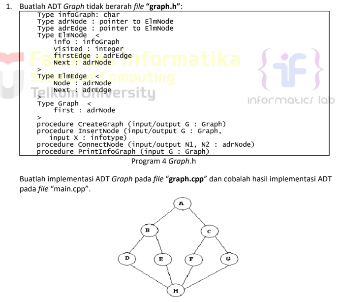
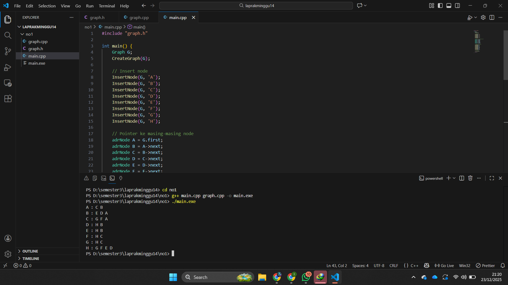
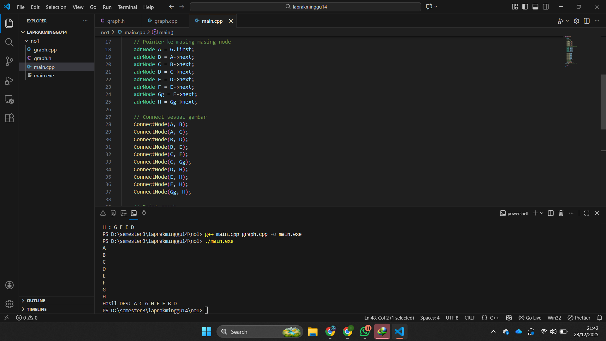

# <h1 align="center">Laporan Praktikum Modul 14 <br> Graph </h1>
<p align="center">Zaki Hamdani - 103112400089</p>

## Dasar Teori

Graph merupakan salah satu struktur data yang terdiri dari sekumpulan simpul (node/vertex) dan sisi penghubung (edge) yang merepresentasikan hubungan antar simpul. Graph dapat dibedakan menjadi graph berarah dan tidak berarah, di mana pada graph tidak berarah setiap edge menghubungkan dua node tanpa arah tertentu. Dalam implementasinya, graph dapat direpresentasikan menggunakan beberapa cara, salah satunya adalah multi linked list, yang memanfaatkan pointer sehingga bersifat dinamis dan efisien dalam pengelolaan data. Setiap node menyimpan informasi data, penanda kunjungan (visited), serta pointer ke daftar edge yang menunjukkan node-node tetangganya. Untuk melakukan penelusuran graph digunakan algoritma traversal, salah satunya adalah Depth First Search (DFS), yaitu metode penelusuran yang mengunjungi node awal kemudian menelusuri node-node tetangganya secara mendalam hingga tidak ada lagi node yang dapat dikunjungi sebelum kembali ke node sebelumnya, sehingga setiap node dikunjungi tepat satu kali.

## Guide

### graf.h
```go
#ifndef GRAF_H_INCLUDED
#define GRAF_H_INCLUDED

#include <iostream>
using namespace std;

typedef char infoGraph;

struct ElmNode;
struct ElmEdge;

typedef ElmNode *adrNode;
typedef ElmEdge *adrEdge;

struct ElmNode
{
    infoGraph info;
    int visited;
    adrEdge firstEdge;
    adrNode next;
};

struct ElmEdge
{
    adrNode node;
    adrEdge next;
};

struct Graph
{
    adrNode first;
};

// PRIMITIF GRAPH
void CreateGraph(Graph &G);
adrNode AllocateNode(infoGraph X);
adrEdge AllocateEdge(adrNode N);

void InsertNode(Graph &G, infoGraph X);
adrNode FindNode(Graph G, infoGraph X);

void ConnectNode(Graph &G, infoGraph A, infoGraph B);

void PrintInfoGraph(Graph G);

// Traversal
void ResetVisited(Graph &G);
void PrintDFS(Graph &G, adrNode N);
void PrintBFS(Graph &G, adrNode N);

#endif
```

### graf.cpp
```go
#include "graf.h"
#include <queue>
#include <stack>

void CreateGraph(Graph &G)
{
    G.first = NULL;
}

adrNode AllocateNode(infoGraph X)
{
    adrNode P = new ElmNode;
    P->info = X;
    P->visited = 0;
    P->firstEdge = NULL;
    P->next = NULL;
    return P;
}

adrEdge AllocateEdge(adrNode N)
{
    adrEdge P = new ElmEdge;
    P->node = N;
    P->next = NULL;
    return P;
}

void InsertNode(Graph &G, infoGraph X)
{
    adrNode P = AllocateNode(X);
    P->next = G.first;
    G.first = P;
}

adrNode FindNode(Graph G, infoGraph X)
{
    adrNode P = G.first;
    while (P != NULL)
    {
        if (P->info == X)
            return P;
        P = P->next;
    }
    return NULL;
}

void ConnectNode(Graph &G, infoGraph A, infoGraph B)
{
    adrNode N1 = FindNode(G, A);
    adrNode N2 = FindNode(G, B);

    if (N1 == NULL || N2 == NULL)
    {
        cout << "Node tidak ditemukan!\n";
        return;
    }

    // Buat edge dari N1 ke N2
    adrEdge E1 = AllocateEdge(N2);
    E1->next = N1->firstEdge;
    N1->firstEdge = E1;

    // Karena undirected → buat edge balik
    adrEdge E2 = AllocateEdge(N1);
    E2->next = N2->firstEdge;
    N2->firstEdge = E2;
}

void PrintInfoGraph(Graph G)
{
    adrNode P = G.first;
    while (P != NULL)
    {
        cout << P->info << " -> ";
        adrEdge E = P->firstEdge;
        while (E != NULL)
        {
            cout << E->node->info << " ";
            E = E->next;
        }
        cout << endl;
        P = P->next;
    }
}

void ResetVisited(Graph &G)
{
    adrNode P = G.first;
    while (P != NULL)
    {
        P->visited = 0;
        P = P->next;
    }
}

void PrintDFS(Graph &G, adrNode N)
{
    if (N == NULL)
        return;

    N->visited = 1;
    cout << N->info << " ";

    adrEdge E = N->firstEdge;
    while (E != NULL)
    {
        if (E->node->visited == 0)
        {
            PrintDFS(G, E->node);
        }
        E = E->next;
    }
}

void PrintBFS(Graph &G, adrNode N)
{
    if (N == NULL)
        return;

    queue<adrNode> Q;
    Q.push(N);

    while (!Q.empty())
    {
        adrNode curr = Q.front();
        Q.pop();

        if (curr->visited == 0)
        {
            curr->visited = 1;
            cout << curr->info << " ";

            adrEdge E = curr->firstEdge;
            while (E != NULL)
            {
                if (E->node->visited == 0)
                {
                    Q.push(E->node);
                }
                E = E->next;
            }
        }
    }
}

```

### main.cpp
```go
#include "graf.h"
#include "graf.cpp"
#include <iostream>
using namespace std;

int main()
{
    Graph G;
    CreateGraph(G);

    // Tambah node
    InsertNode(G, 'A');
    InsertNode(G, 'B');
    InsertNode(G, 'C');
    InsertNode(G, 'D');
    InsertNode(G, 'E');

    // Hubungkan node (graph tidak berarah)
    ConnectNode(G, 'A', 'B');
    ConnectNode(G, 'A', 'C');
    ConnectNode(G, 'B', 'D');
    ConnectNode(G, 'C', 'E');

    cout << "=== Struktur Graph ===\n";
    PrintInfoGraph(G);

    cout << "\n=== DFS dari Node A ===\n";
    ResetVisited(G);
    PrintDFS(G, FindNode(G, 'A'));

    cout << "\n\n=== BFS dari Node A ===\n";
    ResetVisited(G);
    PrintBFS(G, FindNode(G, 'A'));

    cout << endl;
    return 0;
}

```


## Unguide

### Soal 1
> 


### graph.h
```go
#ifndef GRAPH_H
#define GRAPH_H

#include <iostream>
using namespace std;

typedef char infoGraph;
typedef struct ElmNode* adrNode;
typedef struct ElmEdge* adrEdge;

//Struktur Node
struct ElmNode {
    infoGraph info;
    int visited;
    adrEdge firstEdge;
    adrNode next;
};

//Struktur Edge
struct ElmEdge {
    adrNode node;
    adrEdge next;
};

// Struktur Graph
struct Graph {
    adrNode first;
};

//Prototype
void CreateGraph(Graph &G);
adrNode CreateNode(infoGraph X);
void InsertNode(Graph &G, infoGraph X);
void ConnectNode(adrNode N1, adrNode N2);
void PrintInfoGraph(Graph G);

#endif
```

### graph.cpp
```go
#include "graph.h"

//Membuat graph kosong
void CreateGraph(Graph &G) {
    G.first = NULL;
}

// Membuat node baru
adrNode CreateNode(infoGraph X) {
    adrNode P = new ElmNode;
    P->info = X;
    P->visited = 0;
    P->firstEdge = NULL;
    P->next = NULL;
    return P;
}

//Insert node ke graph
void InsertNode(Graph &G, infoGraph X) {
    adrNode P = CreateNode(X);
    if (G.first == NULL) {
        G.first = P;
    } else {
        adrNode Q = G.first;
        while (Q->next != NULL) {
            Q = Q->next;
        }
        Q->next = P;
    }
}

//Menghubungkan dua node (tidak berarah)
void ConnectNode(adrNode N1, adrNode N2) {
    adrEdge E1 = new ElmEdge;
    E1->node = N2;
    E1->next = N1->firstEdge;
    N1->firstEdge = E1;

    adrEdge E2 = new ElmEdge;
    E2->node = N1;
    E2->next = N2->firstEdge;
    N2->firstEdge = E2;
}

//Menampilkan graph
void PrintInfoGraph(Graph G) {
    adrNode P = G.first;
    while (P != NULL) {
        cout << P->info << " : ";
        adrEdge E = P->firstEdge;
        while (E != NULL) {
            cout << E->node->info << " ";
            E = E->next;
        }
        cout << endl;
        P = P->next;
    }
}
```

### main.cpp
```go
#include "graph.h"

int main() {
    Graph G;
    CreateGraph(G);

    // Insert node
    InsertNode(G, 'A');
    InsertNode(G, 'B');
    InsertNode(G, 'C');
    InsertNode(G, 'D');
    InsertNode(G, 'E');
    InsertNode(G, 'F');
    InsertNode(G, 'G');
    InsertNode(G, 'H');

    // Pointer ke masing-masing node
    adrNode A = G.first;
    adrNode B = A->next;
    adrNode C = B->next;
    adrNode D = C->next;
    adrNode E = D->next;
    adrNode F = E->next;
    adrNode Gg = F->next;
    adrNode H = Gg->next;

    // Connect sesuai gambar
    ConnectNode(A, B);
    ConnectNode(A, C);
    ConnectNode(B, D);
    ConnectNode(B, E);
    ConnectNode(C, F);
    ConnectNode(C, Gg);
    ConnectNode(D, H);
    ConnectNode(E, H);
    ConnectNode(F, H);
    ConnectNode(Gg, H);

    // Print graph
    PrintInfoGraph(G);

    return 0;
}
```

> Output
> 

Program ini merupakan implementasi **ADT Graph tidak berarah** yang direpresentasikan menggunakan **linked list** untuk menyimpan node dan edge. Setiap node (`ElmNode`) menyimpan data berupa karakter, penanda kunjungan, pointer ke edge pertama, serta pointer ke node berikutnya, sedangkan setiap edge (`ElmEdge`) menyimpan alamat node tujuan dan pointer ke edge selanjutnya. Struktur `Graph` hanya menyimpan alamat node pertama sebagai titik awal graph. Prosedur `CreateGraph` digunakan untuk membuat graph kosong, `InsertNode` untuk menambahkan node ke dalam graph, `ConnectNode` untuk menghubungkan dua node secara dua arah (karena graph tidak berarah), dan `PrintInfoGraph` untuk menampilkan setiap node beserta node-node yang terhubung dengannya.


### Soal 2 & 3
Buatlah prosedur untuk menapilkan hasil penelusuran DFS.

prosedur PrintDFS (Graph G, adrNode N);


### graph.h
```go
void PrintDFS(Graph G, adrNode N); // menampilkan penelusuran DFS

```

### graph.cpp
```go
void PrintDFS(Graph G, adrNode N) {
    if (N == NULL || N->visited == 1) {
        return; // jika node kosong atau sudah dikunjungi
    }

    cout << N->info << " "; // tampilkan node
    N->visited = 1;         // tandai sudah dikunjungi

    adrEdge E = N->firstEdge;
    while (E != NULL) {
        PrintDFS(G, E->node); // telusuri node tetangga
        E = E->next;
    }
}

```

### main.h
```go
cout << "Hasil DFS: ";
PrintDFS(G, A); // A adalah node awal
cout << endl;
```

> Output
> 

Prosedur **PrintDFS** digunakan untuk menampilkan hasil penelusuran graph dengan metode **Depth First Search (DFS)**, yaitu menelusuri satu node sedalam mungkin ke node tetangganya sebelum berpindah ke cabang lain. Proses dimulai dari node awal `N`, kemudian node tersebut ditampilkan dan diberi tanda `visited` agar tidak dikunjungi kembali. Selanjutnya, prosedur akan menelusuri setiap node yang terhubung melalui edge menggunakan pemanggilan rekursif hingga tidak ada lagi node yang bisa dikunjungi. Dengan cara ini, DFS memastikan setiap node dalam graph dikunjungi satu kali sesuai kedalaman penelusuran.


## Referensi
1. https://www.w3schools.com/dsa/dsa_theory_graphs.php
2. https://www.w3schools.com/dsa/dsa_algo_graphs_traversal.php
3. https://www.w3schools.com/dsa/dsa_data_graphs_implementation.php
4. https://www.w3schools.com/dsa/dsa_intro.php
5. https://www.w3schools.com/dsa/dsa_ref_greedy.php
