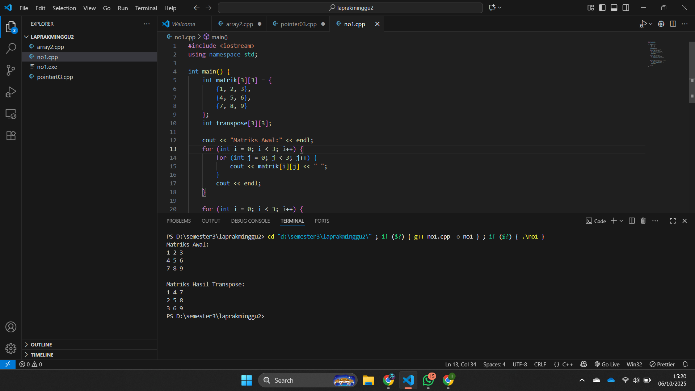
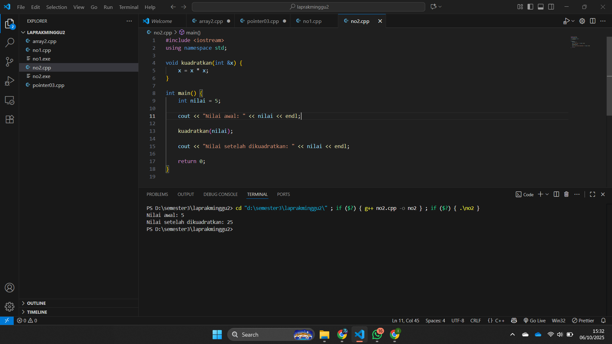

# <h1 align="center">Laporan Praktikum Modul 2 <br> Pengenalan C++</h1>
<p align="center">Zaki Hamdani - 103112400089</p>

## Dasar Teori

Call by reference adalah metode pemanggilan fungsi di C++ di mana yang dikirim ke fungsi bukan nilai variabel, melainkan alamat memorinya. Dengan menambahkan tanda & pada parameter, fungsi dapat mengakses dan mengubah nilai asli variabel yang dikirim dari program utama. Berbeda dengan call by value yang hanya menyalin nilai, call by reference memungkinkan perubahan di dalam fungsi langsung memengaruhi variabel asli. Metode ini lebih efisien karena tidak membuat salinan data dan sering digunakan saat program perlu memodifikasi nilai variabel secara langsung.

## Guide

## 01_Array
```go
#include <iostream>
using namespace std;

int main() {

    int nilai[5] = {1, 2, 3, 4, 5};

    for ( int i = 0;  i < 5; i++)
    {
       
        cout << "elemen ke-" << i << "=" << nilai[i] << endl;
    }
    return 0;
}
```

## 02_Array
```go
#include <iostream>
using namespace std;

int main() {
    int matrik[3][3] = {
        {1, 2, 3},
        {4, 5, 6},
        {7, 8, 9}
    };

    for (int i = 0; i < 3; ++i) {
        for (int j = 0; j < 3; ++j) {
            cout << matrik[i][j] << " ";
        }
        cout << endl;
    }

    return 0;
}
```

## 03_pointer
```go
#include <iostream>
using namespace std;

int main()
{
    int umur = 25;
    int *p_umur;

    p_umur = &umur;

    cout << "Nilai 'umur' : " << umur << endl;
    cout << "Alamat memori 'umur' : " << &umur << endl;
    cout << "Nilai 'p_umur' (alamat) : " << p_umur << endl;
    cout << "Nilai yang diakses 'p_umur' : " << *p_umur << endl;
    cout << "Alamat memori dari pointer 'p_umur' itu sendiri : " << &p_umur << endl;

    return 0;
}
```

## 04_array_pointer
```go
#include <iostream>
using namespace std;

int main()
{
    int data[5] = {10, 20, 30, 40, 50};
    int *p_data = data;

    cout << "Mengakses elemen array cara normal:" << endl;

    for (int i = 0; i < 5; ++i)
    {
        cout << "Nilai elemen ke-" << i << " : " << data[i] << endl;
    }

    cout << "Mengakses elemen array menggunakan pointer:" << endl;

    for (int i = 0; i < 5; ++i)
    {
        cout << "Nilai elemen ke-" << i << " : " << *(p_data + i) << endl;
    }

    return 0;
}
```

## 05_string_pointer
```go
#include <iostream>
using namespace std;

int main()
{
    char pesan_array[] = "Nasi Padang";
    char *pesan_pointer = "Ayam Bakar 23";

    cout << "String Array: " << pesan_array << endl;
    cout << "String Pointer: " << pesan_pointer << endl;

    // Mengubah karakter dalam array diperbolehkan
    pesan_array[0] = 'h';
    cout << "String Array setelah diubah: " << pesan_array << endl;

    // Pointer dapat diubah untuk menunjuk ke string lain
    pesan_pointer = "Sariman";
    cout << "String Pointer setelah menunjuk ke string lain: " << pesan_pointer << endl;

    return 0;
}
```

## 06_
```go

```

## 07_call_by_pointer
```go
#include <iostream>
using namespace std;

int main()
{
    int a = 10, b = 20;
    cout << "Sebelum ditukar: a = " << a << ", b = " << b << endl;
    tukar(&a, &b);
    cout << "Setelah ditukar: a = " << a << ", b = " << b << endl;
    return 0;
}

void tukar(int *px, int *py)
{
    int temp = *px;
    *px = *py;
    *py = temp;
}
```

## 08_call_by_reference
```go
#include <iostream>
using namespace std;

int main()
{
    int a = 10, b = 20;
    cout << "Sebelum ditukar: a = " << a << ", b = " << b << endl;
    tukar(a, b);
    cout << "Setelah ditukar: a = " << a << ", b = " << b << endl;
    return 0;
}

void tukar(int &x, int &y)
{
    int temp = x;
    x = y;
    y = temp;
}
```


## Unguide

### Soal 1

Buatlah sebuah program untuk melakukan transpose pada sebuah matriks persegi berukuran 3x3. Operasi transpose adalah mengubah baris menjadi kolom dan sebaliknya. Inisialisasi matriks awal di dalam kode, kemudian buat logika untuk melakukan transpose dan simpan hasilnya ke dalam matriks baru. Terakhir, tampilkan matriks awal dan matriks hasil transpose.

Contoh Output:

Matriks Awal:

1 2 3

4 5 6

7 8 9

Matriks Hasil Transpose:

1 4 7

2 5 8

3 6 9

```go
#include <iostream>
using namespace std;

int main() {
    int matrik[3][3] = {
        {1, 2, 3},
        {4, 5, 6},
        {7, 8, 9}
    };
    int transpose[3][3];

    cout << "Matriks Awal:" << endl;
    for (int i = 0; i < 3; i++) {
        for (int j = 0; j < 3; j++) {
            cout << matrik[i][j] << " ";
        }
        cout << endl;
    }

    for (int i = 0; i < 3; i++) {
        for (int j = 0; j < 3; j++) {
            transpose[j][i] = matrik[i][j];
        }
    }

    cout << "\nMatriks Hasil Transpose:" << endl;
    for (int i = 0; i < 3; i++) {
        for (int j = 0; j < 3; j++) {
            cout << transpose[i][j] << " ";
        }
        cout << endl;
    }

    return 0;
}
```

> Output
> 

Program di atas Program ini berfungsi untuk melakukan **transpose** pada matriks 3x3, yaitu menukar baris menjadi kolom dan sebaliknya. Di awal, matriks `matrik` diinisialisasi dengan nilai 1–9, lalu dibuat matriks kosong `transpose` untuk menampung hasilnya. Program pertama menampilkan matriks awal, kemudian menggunakan dua perulangan untuk menukar posisi elemen dengan rumus `transpose[j][i] = matrik[i][j]`. Setelah proses selesai, hasil transpose ditampilkan, menghasilkan matriks dengan baris dan kolom yang saling bertukar posisi.


### Soal 2

Buatlah program yang menunjukkan penggunaan call by reference. Buat sebuah prosedur bernama kuadratkan yang menerima satu parameter integer secara referensi (&). Prosedur ini akan mengubah nilai asli variabel yang dilewatkan dengan nilai kuadratnya. Tampilkan nilai variabel di main() sebelum dan sesudah memanggil prosedur untuk membuktikan perubahannya. 

Contoh Output:

Nilai awal: 5
Nilai setelah dikuadratkan: 25

```go
#include <iostream>
using namespace std;

void kuadratkan(int &x) {
    x = x * x;
}

int main() {
    int nilai = 5;

    cout << "Nilai awal: " << nilai << endl;

    kuadratkan(nilai);

    cout << "Nilai setelah dikuadratkan: " << nilai << endl;

    return 0;
}
```

> Output
> 

Program ini menggunakan call by reference agar parameter x di prosedur kuadratkan langsung mengacu pada variabel asli yang dikirim dari main(). Dengan demikian, ketika x dikuadratkan (x = x * x), nilai asli variabel nilai ikut berubah. Hasilnya, setelah prosedur dipanggil, nilai nilai berubah dari 5 menjadi 25.

## Referensi
1. https://www.w3schools.com/cpp/cpp_references.asp
2. https://www.w3schools.com/cpp/cpp_function_reference.asp
3. https://www.w3schools.com/cpp/cpp_function_structures.asp
4. https://www.w3schools.com/cpp/exercise.asp?x=xrcise_function_reference1
5. https://www.w3schools.com/cpp/cpp_function_param.asp


