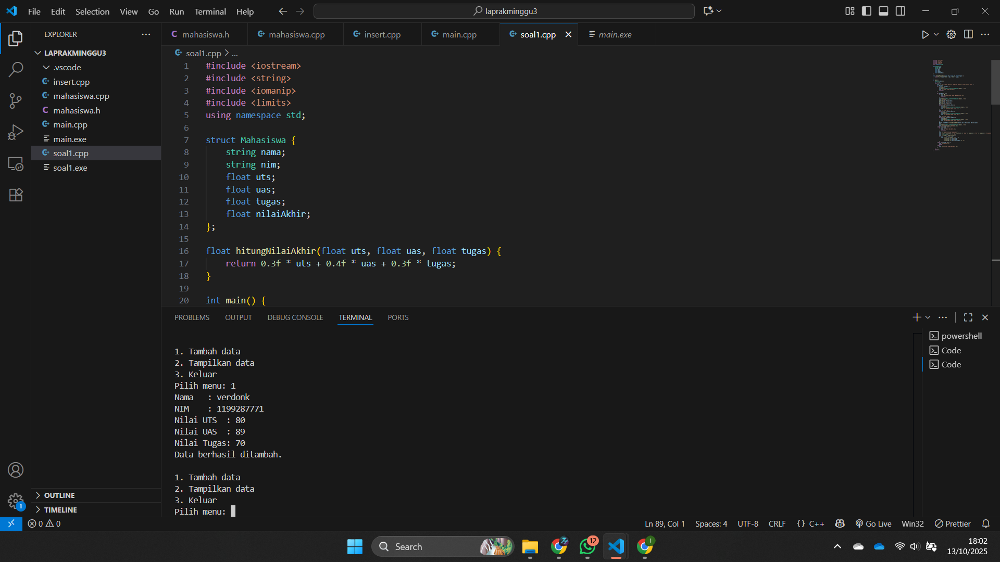
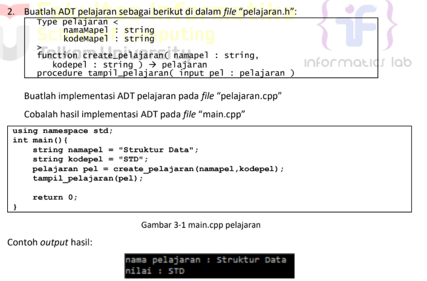
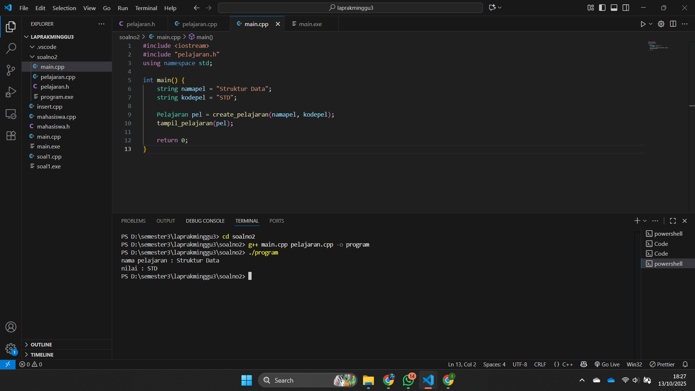
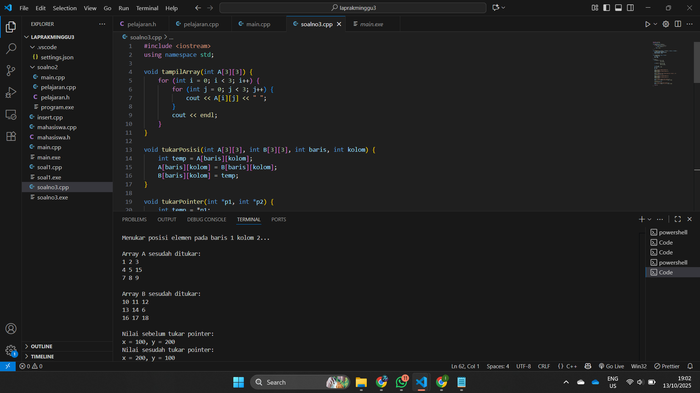

# <h1 align="center">Laporan Praktikum Modul 3 <br> Abstract Data Type</h1>
<p align="center">Zaki Hamdani - 103112400089</p>

## Dasar Teori

Abstract Data Type (ADT) membahas konsep pembentukan tipe data abstrak yang memisahkan antara spesifikasi dan implementasi suatu tipe data. ADT merupakan tipe data buatan pengguna yang memiliki sekumpulan operasi dasar (primitif) untuk mengelola dan memanipulasi data, seperti konstruktor, selektor, mutator, validator, dan destruktor. Dalam penerapannya, ADT biasanya terdiri dari dua bagian, yaitu file header (.h) yang berisi definisi tipe dan deklarasi fungsi, serta file implementasi (.cpp) yang memuat realisasi fungsinya. Konsep ini meningkatkan modularitas, keterbacaan, dan kemudahan pemeliharaan program, seperti pada contoh ADT mahasiswa dan pelajaran dalam bahasa C++.

## Guide

## Menghitung Rata Rata

## mahasiswa.h
```go
#ifndef MAHASISWA_H_INCLUDED
#define MAHASISWA_H_INCLUDED

struct mahasiswa
{
    char nim[10];
    int nilai1, nilai2;
};

void inputMhs(mahasiswa &m);
float rata2(mahasiswa m);

#endif
```

## Mahasiswa.cpp
```go
#include "mahasiswa.h"
#include <iostream>
using namespace std;

void inputMhs(mahasiswa &m)
{
    cout << "input nama = ";
    cin >> (m) .nim;
    cout << "input nilai = ";
    cin >> (m) .nilai1;
    cout << "input niali2 = ";
    cin >> m .nilai2;

}
float rata2(mahasiswa m)
{
    return float(m.nilai1 + m.nilai2) / 2;
}
```

## main.cpp
```go
#include <iostream>
#include "mahasiswa.h"
using namespace std;

int main(){
    mahasiswa mhs;
    inputMhs(mhs);
    cout << "rata rata = " << rata2(mhs);
    return 0;
}
```

## Unguide

# <h1 align="center">Laporan Praktikum Modul 3 <br> Abstract Data Type</h1>
<p align="center">Zaki Hamdani - 103112400089</p>

## Dasar Teori

Abstract Data Type (ADT) membahas konsep pembentukan tipe data abstrak yang memisahkan antara spesifikasi dan implementasi suatu tipe data. ADT merupakan tipe data buatan pengguna yang memiliki sekumpulan operasi dasar (primitif) untuk mengelola dan memanipulasi data, seperti konstruktor, selektor, mutator, validator, dan destruktor. Dalam penerapannya, ADT biasanya terdiri dari dua bagian, yaitu file header (.h) yang berisi definisi tipe dan deklarasi fungsi, serta file implementasi (.cpp) yang memuat realisasi fungsinya. Konsep ini meningkatkan modularitas, keterbacaan, dan kemudahan pemeliharaan program, seperti pada contoh ADT mahasiswa dan pelajaran dalam bahasa C++.

## Guide

## Menghitung Rata Rata

## mahasiswa.h
```go
#ifndef MAHASISWA_H_INCLUDED
#define MAHASISWA_H_INCLUDED

struct mahasiswa
{
    char nim[10];
    int nilai1, nilai2;
};

void inputMhs(mahasiswa &m);
float rata2(mahasiswa m);

#endif
```

## Mahasiswa.cpp
```go
#include "mahasiswa.h"
#include <iostream>
using namespace std;

void inputMhs(mahasiswa &m)
{
    cout << "input nama = ";
    cin >> (m) .nim;
    cout << "input nilai = ";
    cin >> (m) .nilai1;
    cout << "input niali2 = ";
    cin >> m .nilai2;

}
float rata2(mahasiswa m)
{
    return float(m.nilai1 + m.nilai2) / 2;
}
```

## main.cpp
```go
#include <iostream>
#include "mahasiswa.h"
using namespace std;

int main(){
    mahasiswa mhs;
    inputMhs(mhs);
    cout << "rata rata = " << rata2(mhs);
    return 0;
}
```

## Unguide

### Soal 1

Buat program yang dapat menyimpan data mahasiswa (max. 10) ke dalam sebuah array
dengan field nama, nim, uts, uas, tugas, dan nilai akhir. Nilai akhir diperoleh dari FUNGSI
dengan rumus 0.3*uts+0.4*uas+0.3*tugas.
```go
#include <iostream>
#include <string>
#include <iomanip>
#include <limits>
using namespace std;

struct Mahasiswa {
    string nama;
    string nim;
    float uts;
    float uas;
    float tugas;
    float nilaiAkhir;
};

float hitungNilaiAkhir(float uts, float uas, float tugas) {
    return 0.3f * uts + 0.4f * uas + 0.3f * tugas;
}

int main() {
    Mahasiswa mhs[10];
    int n = 0;
    while (true) {
        cout << "\n1. Tambah data\n2. Tampilkan data\n3. Keluar\nPilih menu: ";
        int pilihan;
        if (!(cin >> pilihan)) {
            cin.clear();
            cin.ignore(numeric_limits<streamsize>::max(), '\n');
            cout << "Input tidak valid.\n";
            continue;
        }

        if (pilihan == 1) {
            if (n >= 10) {
                cout << "Data penuh (maks 10 mahasiswa).\n";
                continue;
            }
            cin.ignore(numeric_limits<streamsize>::max(), '\n');
            cout << "Nama   : ";
            getline(cin, mhs[n].nama);
            cout << "NIM    : ";
            getline(cin, mhs[n].nim);
            cout << "Nilai UTS  : ";
            while (!(cin >> mhs[n].uts)) {
                cin.clear();
                cin.ignore(numeric_limits<streamsize>::max(), '\n');
                cout << "Masukkan angka untuk UTS: ";
            }
            cout << "Nilai UAS  : ";
            while (!(cin >> mhs[n].uas)) {
                cin.clear();
                cin.ignore(numeric_limits<streamsize>::max(), '\n');
                cout << "Masukkan angka untuk UAS: ";
            }
            cout << "Nilai Tugas: ";
            while (!(cin >> mhs[n].tugas)) {
                cin.clear();
                cin.ignore(numeric_limits<streamsize>::max(), '\n');
                cout << "Masukkan angka untuk Tugas: ";
            }
            mhs[n].nilaiAkhir = hitungNilaiAkhir(mhs[n].uts, mhs[n].uas, mhs[n].tugas);
            n++;
            cin.ignore(numeric_limits<streamsize>::max(), '\n');
            cout << "Data berhasil ditambah.\n";
        } else if (pilihan == 2) {
            if (n == 0) {
                cout << "Belum ada data.\n";
                continue;
            }
            cout << "\nDaftar Nilai Mahasiswa\n";
            cout << left << setw(4) << "No" << setw(25) << "Nama" << setw(12) << "NIM" << setw(10) << "NilaiAkhir" << '\n';
            cout << string(55, '-') << '\n';
            cout << fixed << setprecision(2);
            for (int i = 0; i < n; ++i) {
                cout << left << setw(4) << (i + 1)
                     << setw(25) << mhs[i].nama
                     << setw(12) << mhs[i].nim
                     << setw(10) << mhs[i].nilaiAkhir << '\n';
            }
        } else if (pilihan == 3) {
            cout << "Keluar.\n";
            break;
        } else {
            cout << "Pilihan tidak tersedia.\n";
        }
    }
    return 0;
}
```

> Output
> 

Program ini merupakan aplikasi sederhana untuk mengelola data mahasiswa menggunakan struktur data dan fungsi dalam bahasa C++. Program mendefinisikan sebuah struct bernama *Mahasiswa* yang berisi field nama, NIM, nilai UTS, UAS, tugas, dan nilai akhir. Fungsi *hitungNilaiAkhir()* digunakan untuk menghitung nilai akhir mahasiswa dengan rumus 0.3 × UTS + 0.4 × UAS + 0.3 × tugas. Di dalam fungsi utama (*main*), program menampilkan menu dengan tiga pilihan yaitu menambah data, menampilkan data, dan keluar. Pengguna dapat memasukkan hingga 10 data mahasiswa, di mana setiap data yang diinput akan otomatis dihitung nilai akhirnya. Hasil data kemudian ditampilkan dalam bentuk tabel rapi menggunakan format dari pustaka *iomanip*. Program ini juga dilengkapi validasi input dan pembatasan jumlah data, sehingga mencerminkan penerapan prinsip modularitas, pengelolaan data terstruktur, serta konsep dasar *Abstract Data Type (ADT)* dalam pemrograman.


### Soal 2
> 

# pelajaran.h
```go
#ifndef PELAJARAN_H_INCLUDED
#define PELAJARAN_H_INCLUDED
#include <string>
using namespace std;

struct Pelajaran {
    string namaMapel;
    string kodeMapel;
};

Pelajaran create_pelajaran(string namapel, string kodepel);
void tampil_pelajaran(Pelajaran pel);

#endif
```

# pelajaran.cpp
```go
#include <iostream>
#include "pelajaran.h"
using namespace std;

Pelajaran create_pelajaran(string namapel, string kodepel) {
    Pelajaran p;
    p.namaMapel = namapel;
    p.kodeMapel = kodepel;
    return p;
}

void tampil_pelajaran(Pelajaran pel) {
    cout << "nama pelajaran : " << pel.namaMapel << endl;
    cout << "nilai : " << pel.kodeMapel << endl;
}
```

# main.cpp
```go
#include <iostream>
#include "pelajaran.h"
using namespace std;

int main() {
    string namapel = "Struktur Data";
    string kodepel = "STD";

    Pelajaran pel = create_pelajaran(namapel, kodepel);
    tampil_pelajaran(pel);

    return 0;
}
```

> Output
> 

Program ini merupakan penerapan konsep **Abstract Data Type (ADT)** dalam bahasa C++, yang memisahkan antara *definisi tipe data*, *implementasi fungsi*, dan *pengujian program utama*. Pada file **`pelajaran.h`**, didefinisikan tipe data `struct Pelajaran` yang memiliki dua atribut yaitu `namaMapel` dan `kodeMapel`, serta deklarasi dua fungsi `create_pelajaran()` dan `tampil_pelajaran()`. File **`pelajaran.cpp`** berisi implementasi fungsi-fungsi tersebut, di mana `create_pelajaran()` berfungsi sebagai *konstruktor* untuk membuat objek pelajaran baru dengan mengisi nama dan kode, sedangkan `tampil_pelajaran()` digunakan untuk menampilkan data pelajaran ke layar. File **`main.cpp`** berperan sebagai program utama yang menguji ADT dengan membuat objek pelajaran menggunakan fungsi `create_pelajaran()` dan menampilkannya melalui `tampil_pelajaran()`. Dengan pembagian ini, program menjadi lebih modular, mudah dikelola, serta mencerminkan penerapan prinsip dasar ADT, yaitu pemisahan antara spesifikasi dan implementasi.


### Soal 3
Buatlah program dengan ketentuan :
- 2 buah array 2D integer berukuran 3x3 dan 2 buah pointer integer
- fungsi/prosedur yang menampilkan isi sebuah array integer 2D
- fungsi/prosedur yang akan menukarkan isi dari 2 array integer 2D pada posisi tertentu
- fungsi/prosedur yang akan menukarkan isi dari variabel yang ditunjuk oleh 2 buah
pointer

```go
#include <iostream>
using namespace std;

void tampilArray(int A[3][3]) {
    for (int i = 0; i < 3; i++) {
        for (int j = 0; j < 3; j++) {
            cout << A[i][j] << " ";
        }
        cout << endl;
    }
}

void tukarPosisi(int A[3][3], int B[3][3], int baris, int kolom) {
    int temp = A[baris][kolom];
    A[baris][kolom] = B[baris][kolom];
    B[baris][kolom] = temp;
}

void tukarPointer(int *p1, int *p2) {
    int temp = *p1;
    *p1 = *p2;
    *p2 = temp;
}

int main() {
    int A[3][3] = { {1, 2, 3},
                    {4, 5, 6},
                    {7, 8, 9} };

    int B[3][3] = { {10, 11, 12},
                    {13, 14, 15},
                    {16, 17, 18} };

    int *p1, *p2;
    int x = 100, y = 200;
    p1 = &x;
    p2 = &y;

    cout << "Array A sebelum ditukar:\n";
    tampilArray(A);
    cout << "\nArray B sebelum ditukar:\n";
    tampilArray(B);

    cout << "\nMenukar posisi elemen pada baris 1 kolom 2...\n";
    tukarPosisi(A, B, 1, 2);

    cout << "\nArray A sesudah ditukar:\n";
    tampilArray(A);
    cout << "\nArray B sesudah ditukar:\n";
    tampilArray(B);

    cout << "\nNilai sebelum tukar pointer:\n";
    cout << "x = " << *p1 << ", y = " << *p2 << endl;

    tukarPointer(p1, p2);

    cout << "Nilai sesudah tukar pointer:\n";
    cout << "x = " << *p1 << ", y = " << *p2 << endl;

    return 0;
}
```

> Output
> 

Program ini merupakan implementasi sederhana dari konsep **fungsi, array dua dimensi, dan pointer** dalam bahasa C++. Program ini menggunakan dua buah array 2D berukuran 3×3 bernama `A` dan `B`, serta dua buah pointer integer `p1` dan `p2` yang masing-masing menunjuk ke variabel `x` dan `y`. Fungsi `tampilArray()` digunakan untuk menampilkan isi sebuah array dua dimensi, sedangkan fungsi `tukarPosisi()` berfungsi menukar nilai dari dua array pada posisi baris dan kolom tertentu. Selain itu, fungsi `tukarPointer()` digunakan untuk menukar nilai dari dua variabel melalui pointer. Pada bagian `main()`, program menampilkan isi awal array A dan B, kemudian menukar elemen pada posisi yang ditentukan dan menampilkannya kembali untuk menunjukkan perubahan hasil pertukaran. Selanjutnya, program juga menampilkan nilai sebelum dan sesudah proses pertukaran melalui pointer. Dengan struktur ini, program mencerminkan penerapan konsep dasar **manipulasi array 2D, penggunaan fungsi, serta operasi pointer** dalam pemrograman terstruktur.


## Referensi
1. https://www.w3schools.com/dsa/dsa_intro.php?utm_source=chatgpt.com 
2. https://www.w3schools.com/cpp/cpp_data_structures.asp?utm_source=chatgpt.com 
3. https://www.w3schools.com/cpp/cpp_data_types.asp?utm_source=chatgpt.com 
4. https://www.w3schools.in/cplusplus/data-abstraction?utm_source=chatgpt.com 
5. https://en.wikipedia.org/wiki/Abstract_data_type?utm_source=chatgpt.com 
