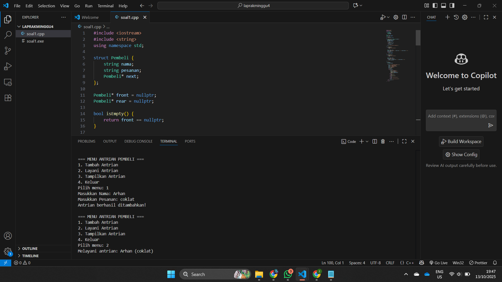
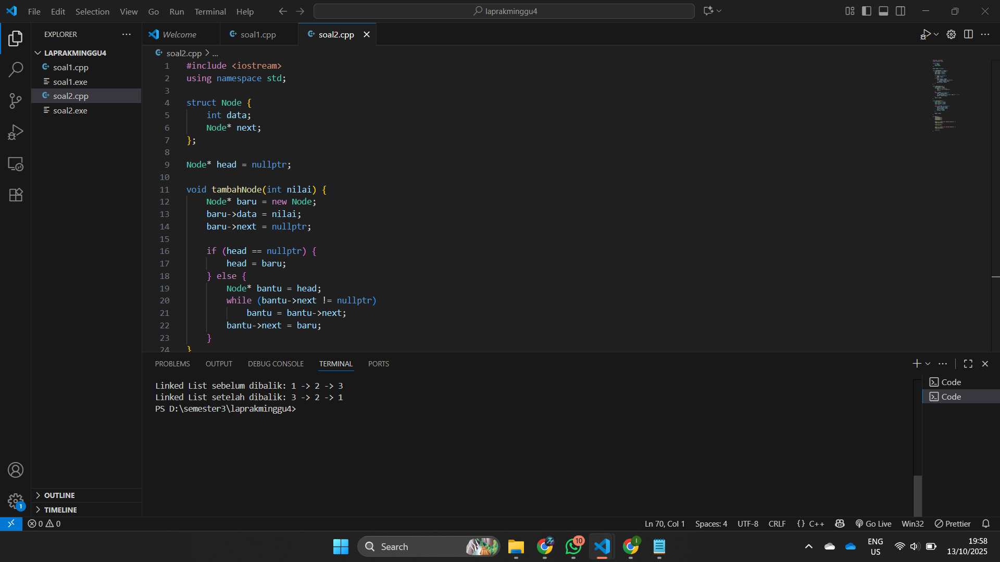

# <h1 align="center">Laporan Praktikum Modul 3 <br> Abstract Data Type</h1>
<p align="center">Zaki Hamdani - 103112400089</p>

## Dasar Teori

Abstract Data Type (ADT) membahas konsep pembentukan tipe data abstrak yang memisahkan antara spesifikasi dan implementasi suatu tipe data. ADT merupakan tipe data buatan pengguna yang memiliki sekumpulan operasi dasar (primitif) untuk mengelola dan memanipulasi data, seperti konstruktor, selektor, mutator, validator, dan destruktor. Dalam penerapannya, ADT biasanya terdiri dari dua bagian, yaitu file header (.h) yang berisi definisi tipe dan deklarasi fungsi, serta file implementasi (.cpp) yang memuat realisasi fungsinya. Konsep ini meningkatkan modularitas, keterbacaan, dan kemudahan pemeliharaan program, seperti pada contoh ADT mahasiswa dan pelajaran dalam bahasa C++.

## Guide

## Menghitung Rata Rata

## mahasiswa.h
```go
#ifndef MAHASISWA_H_INCLUDED
#define MAHASISWA_H_INCLUDED

struct mahasiswa
{
    char nim[10];
    int nilai1, nilai2;
};

void inputMhs(mahasiswa &m);
float rata2(mahasiswa m);

#endif
```

## Mahasiswa.cpp
```go
#include "mahasiswa.h"
#include <iostream>
using namespace std;

void inputMhs(mahasiswa &m)
{
    cout << "input nama = ";
    cin >> (m) .nim;
    cout << "input nilai = ";
    cin >> (m) .nilai1;
    cout << "input niali2 = ";
    cin >> m .nilai2;

}
float rata2(mahasiswa m)
{
    return float(m.nilai1 + m.nilai2) / 2;
}
```

## main.cpp
```go
#include <iostream>
#include "mahasiswa.h"
using namespace std;

int main(){
    mahasiswa mhs;
    inputMhs(mhs);
    cout << "rata rata = " << rata2(mhs);
    return 0;
}
```

## Unguide

### Soal 1
Buatlah single linked list untuk Antrian yang menyimpan data pembeli( nama dan pesanan). program memiliki beberapa menu seperti tambah antrian,  layani antrian(hapus), dan tampilkan antrian. \*antrian pertama harus yang pertama dilayani menggunakan c++
```go
#include <iostream>
#include <string>
using namespace std;

struct Pembeli {
    string nama;
    string pesanan;
    Pembeli* next;
};

Pembeli* front = nullptr;
Pembeli* rear = nullptr;

bool isEmpty() {
    return front == nullptr;
}

void tambahAntrian(string nama, string pesanan) {
    Pembeli* baru = new Pembeli;
    baru->nama = nama;
    baru->pesanan = pesanan;
    baru->next = nullptr;

    if (isEmpty()) {
        front = rear = baru;
    } else {
        rear->next = baru;
        rear = baru;
    }
    cout << "Antrian berhasil ditambahkan!\n";
}

void layaniAntrian() {
    if (isEmpty()) {
        cout << "Antrian kosong!\n";
        return;
    }

    Pembeli* hapus = front;
    cout << "Melayani antrian: " << hapus->nama << " (" << hapus->pesanan << ")\n";
    front = front->next;
    delete hapus;

    if (front == nullptr)
        rear = nullptr;
}

void tampilkanAntrian() {
    if (isEmpty()) {
        cout << "Antrian kosong!\n";
        return;
    }

    Pembeli* bantu = front;
    cout << "Daftar Antrian:\n";
    while (bantu != nullptr) {
        cout << "- " << bantu->nama << " (" << bantu->pesanan << ")\n";
        bantu = bantu->next;
    }
}

int main() {
    int pilihan;
    string nama, pesanan;

    do {
        cout << "\n=== MENU ANTRIAN PEMBELI ===\n";
        cout << "1. Tambah Antrian\n";
        cout << "2. Layani Antrian\n";
        cout << "3. Tampilkan Antrian\n";
        cout << "4. Keluar\n";
        cout << "Pilih menu: ";
        cin >> pilihan;
        cin.ignore();

        switch (pilihan) {
            case 1:
                cout << "Masukkan Nama: ";
                getline(cin, nama);
                cout << "Masukkan Pesanan: ";
                getline(cin, pesanan);
                tambahAntrian(nama, pesanan);
                break;
            case 2:
                layaniAntrian();
                break;
            case 3:
                tampilkanAntrian();
                break;
            case 4:
                cout << "Program selesai.\n";
                break;
            default:
                cout << "Pilihan tidak valid!\n";
        }
    } while (pilihan != 4);

    return 0;
}
```

> Output
> 

Program di atas merupakan implementasi **struktur data antrian (queue)** menggunakan **single linked list** dalam bahasa C++. Setiap elemen antrian berisi data pembeli berupa **nama dan pesanan** yang disimpan dalam struct `Pembeli`. Program menggunakan dua pointer, yaitu `front` untuk menunjuk pembeli yang berada di depan antrian (akan dilayani lebih dulu) dan `rear` untuk menunjuk pembeli terakhir. Fungsi `tambahAntrian()` menambahkan pembeli baru di belakang antrian, `layaniAntrian()` menghapus pembeli dari depan antrian sebagai proses pelayanan, dan `tampilkanAntrian()` menampilkan seluruh daftar pembeli yang sedang menunggu. Menu interaktif disediakan agar pengguna dapat menambah, melayani, atau melihat antrian secara dinamis sesuai urutan kedatangan (FIFO — First In First Out).

### Soal 2
> 

# pelajaran.h
```go
#ifndef PELAJARAN_H_INCLUDED
#define PELAJARAN_H_INCLUDED
#include <string>
using namespace std;

struct Pelajaran {
    string namaMapel;
    string kodeMapel;
};

Pelajaran create_pelajaran(string namapel, string kodepel);
void tampil_pelajaran(Pelajaran pel);

#endif
```

# pelajaran.cpp
```go
#include <iostream>
#include "pelajaran.h"
using namespace std;

Pelajaran create_pelajaran(string namapel, string kodepel) {
    Pelajaran p;
    p.namaMapel = namapel;
    p.kodeMapel = kodepel;
    return p;
}

void tampil_pelajaran(Pelajaran pel) {
    cout << "nama pelajaran : " << pel.namaMapel << endl;
    cout << "nilai : " << pel.kodeMapel << endl;
}
```

# main.cpp
```go
#include <iostream>
#include "pelajaran.h"
using namespace std;

int main() {
    string namapel = "Struktur Data";
    string kodepel = "STD";

    Pelajaran pel = create_pelajaran(namapel, kodepel);
    tampil_pelajaran(pel);

    return 0;
}
```

> Output
> 

Program ini merupakan penerapan konsep **Abstract Data Type (ADT)** dalam bahasa C++, yang memisahkan antara *definisi tipe data*, *implementasi fungsi*, dan *pengujian program utama*. Pada file **`pelajaran.h`**, didefinisikan tipe data `struct Pelajaran` yang memiliki dua atribut yaitu `namaMapel` dan `kodeMapel`, serta deklarasi dua fungsi `create_pelajaran()` dan `tampil_pelajaran()`. File **`pelajaran.cpp`** berisi implementasi fungsi-fungsi tersebut, di mana `create_pelajaran()` berfungsi sebagai *konstruktor* untuk membuat objek pelajaran baru dengan mengisi nama dan kode, sedangkan `tampil_pelajaran()` digunakan untuk menampilkan data pelajaran ke layar. File **`main.cpp`** berperan sebagai program utama yang menguji ADT dengan membuat objek pelajaran menggunakan fungsi `create_pelajaran()` dan menampilkannya melalui `tampil_pelajaran()`. Dengan pembagian ini, program menjadi lebih modular, mudah dikelola, serta mencerminkan penerapan prinsip dasar ADT, yaitu pemisahan antara spesifikasi dan implementasi.


## Referensi
Berikut daftar **link referensi tentang ADT dan konsep terkait** tanpa tambahan sumber dari ChatGPT:

1. https://www.w3schools.com/dsa/dsa_intro.php
2. https://www.w3schools.com/cpp/cpp_data_structures.asp
3. https://www.w3schools.com/cpp/cpp_structs.asp
4. https://www.w3schools.com/cpp/cpp_data_types.asp
5. https://www.w3schools.in/cplusplus/data-abstraction
