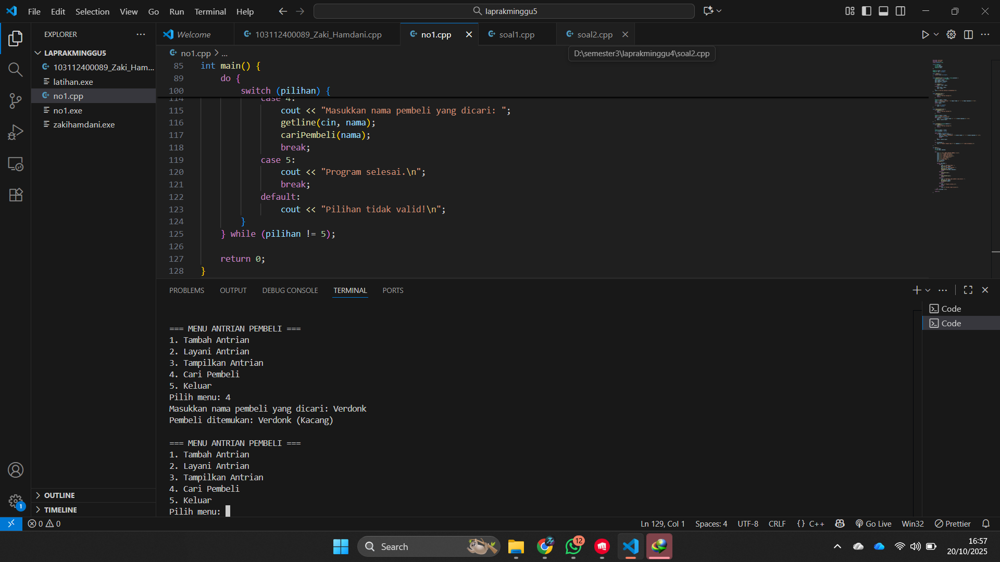
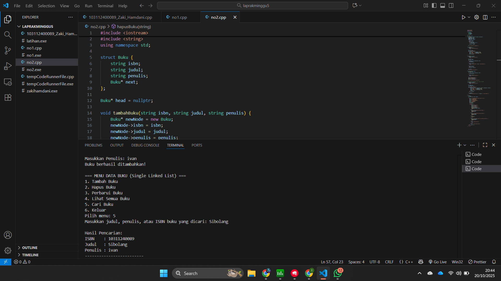

# <h1 align="center">Laporan Praktikum Modul 5 <br> Singly Linked List (Bagian Kedua)</h1>
<p align="center">Zaki Hamdani - 103112400089</p>

## Dasar Teori

singly linked list, yaitu struktur data dinamis yang setiap elemennya terdiri dari dua bagian, yaitu bagian yang menyimpan data (info) dan bagian yang berfungsi sebagai penunjuk ke elemen berikutnya (next). Modul ini berfokus pada pemahaman operasi-operasi dasar dalam linked list seperti membuat list, menambah atau menghapus elemen, menelusuri data (searching), membalik urutan, serta menyalin isi list. Proses pencarian dilakukan dengan menelusuri setiap elemen satu per satu hingga data yang dicari ditemukan. Konsep ini menjadi dasar bagi operasi lain seperti insert after, delete after, dan update. Semua fungsi tersebut dirancang dalam bentuk ADT (Abstract Data Type) menggunakan bahasa pemrograman C++, dengan pembagian kode antara file header (.h) dan file implementasi (.cpp).

## Guide

```go

```


## Unguide

### Soal 1
buatlah searcing untuk mencari nama pembeli pada unguided sebelumnya
```go
#include <iostream>
#include <string>
using namespace std;

struct Pembeli {
    string nama;
    string pesanan;
    Pembeli* next;
};

Pembeli* front = nullptr;
Pembeli* rear = nullptr;

bool isEmpty() {
    return front == nullptr;
}

void tambahAntrian(string nama, string pesanan) {
    Pembeli* baru = new Pembeli;
    baru->nama = nama;
    baru->pesanan = pesanan;
    baru->next = nullptr;

    if (isEmpty()) {
        front = rear = baru;
    } else {
        rear->next = baru;
        rear = baru;
    }
    cout << "Antrian berhasil ditambahkan!\n";
}

void layaniAntrian() {
    if (isEmpty()) {
        cout << "Antrian kosong!\n";
        return;
    }

    Pembeli* hapus = front;
    cout << "Melayani antrian: " << hapus->nama << " (" << hapus->pesanan << ")\n";
    front = front->next;
    delete hapus;

    if (front == nullptr)
        rear = nullptr;
}

void tampilkanAntrian() {
    if (isEmpty()) {
        cout << "Antrian kosong!\n";
        return;
    }

    Pembeli* bantu = front;
    cout << "Daftar Antrian:\n";
    while (bantu != nullptr) {
        cout << "- " << bantu->nama << " (" << bantu->pesanan << ")\n";
        bantu = bantu->next;
    }
}
 // PENAMBAHAN SEARCHING
void cariPembeli(string namaCari) {
    if (isEmpty()) {
        cout << "Antrian kosong!\n";
        return;
    }

    Pembeli* bantu = front;
    bool ditemukan = false;

    while (bantu != nullptr) {
        if (bantu->nama == namaCari) {
            cout << "Pembeli ditemukan: " << bantu->nama << " (" << bantu->pesanan << ")\n";
            ditemukan = true;
            break;
        }
        bantu = bantu->next;
    }

    if (!ditemukan) {
        cout << "Pembeli dengan nama \"" << namaCari << "\" tidak ditemukan.\n";
    }
}

int main() {
    int pilihan;
    string nama, pesanan;

    do {
        cout << "\n=== MENU ANTRIAN PEMBELI ===\n";
        cout << "1. Tambah Antrian\n";
        cout << "2. Layani Antrian\n";
        cout << "3. Tampilkan Antrian\n";
        cout << "4. Cari Pembeli\n";
        cout << "5. Keluar\n";
        cout << "Pilih menu: ";
        cin >> pilihan;
        cin.ignore();

        switch (pilihan) {
            case 1:
                cout << "Masukkan Nama: ";
                getline(cin, nama);
                cout << "Masukkan Pesanan: ";
                getline(cin, pesanan);
                tambahAntrian(nama, pesanan);
                break;
            case 2:
                layaniAntrian();
                break;
            case 3:
                tampilkanAntrian();
                break;
            case 4:
                cout << "Masukkan nama pembeli yang dicari: ";
                getline(cin, nama);
                cariPembeli(nama);
                break;
            case 5:
                cout << "Program selesai.\n";
                break;
            default:
                cout << "Pilihan tidak valid!\n";
        }
    } while (pilihan != 5);

    return 0;
}
```

> Output
> 

Program ini berfungsi untuk mengelola antrian pembeli dengan menggunakan **struktur data linked list**. Setiap pembeli disimpan sebagai node yang berisi nama, pesanan, dan penunjuk ke data berikutnya. Terdapat beberapa fitur utama, yaitu menambah pembeli ke antrian (`tambahAntrian`), melayani pembeli yang berada di urutan pertama (`layaniAntrian`), menampilkan seluruh daftar antrian (`tampilkanAntrian`), dan mencari pembeli berdasarkan nama (`cariPembeli`). Seluruh proses dijalankan melalui menu pilihan dalam fungsi `main`, dan program akan terus berjalan hingga pengguna memilih opsi keluar.


### Soal 2
gunakan latihan pada pertemuan minggun ini dan tambahkan seardhing untuk mencari buku berdasarkan judul, penulis, dan ISBN

```go
#include <iostream>
#include <string>
using namespace std;

struct Buku {
    string isbn;
    string judul;
    string penulis;
    Buku* next;
};

Buku* head = nullptr;

void tambahBuku(string isbn, string judul, string penulis) {
    Buku* newNode = new Buku;
    newNode->isbn = isbn;
    newNode->judul = judul;
    newNode->penulis = penulis;
    newNode->next = nullptr;

    if (head == nullptr) {
        head = newNode;
    } else {
        Buku* temp = head;
        while (temp->next != nullptr) {
            temp = temp->next;
        }
        temp->next = newNode;
    }

    cout << "Buku berhasil ditambahkan!\n";
}

void tampilBuku() {
    if (head == nullptr) {
        cout << "Tidak ada data buku.\n";
        return;
    }

    Buku* temp = head;
    cout << "\nDaftar Buku:\n";
    while (temp != nullptr) {
        cout << "ISBN    : " << temp->isbn << endl;
        cout << "Judul   : " << temp->judul << endl;
        cout << "Penulis : " << temp->penulis << endl;
        cout << "-------------------------\n";
        temp = temp->next;
    }
}

void hapusBuku(string isbn) {
    if (head == nullptr) {
        cout << "Daftar buku kosong.\n";
        return;
    }

    Buku* temp = head;
    Buku* prev = nullptr;

    while (temp != nullptr && temp->isbn != isbn) {
        prev = temp;
        temp = temp->next;
    }

    if (temp == nullptr) {
        cout << "Buku dengan ISBN " << isbn << " tidak ditemukan.\n";
        return;
    }

    if (prev == nullptr) {
        head = head->next;
    } else {
        prev->next = temp->next;
    }

    delete temp;
    cout << "Buku berhasil dihapus!\n";
}

void perbaruiBuku(string isbn) {
    Buku* temp = head;

    while (temp != nullptr && temp->isbn != isbn) {
        temp = temp->next;
    }

    if (temp == nullptr) {
        cout << "Buku tidak ditemukan.\n";
        return;
    }

    cout << "Masukkan judul baru: ";
    getline(cin, temp->judul);
    cout << "Masukkan penulis baru: ";
    getline(cin, temp->penulis);

    cout << "Data buku berhasil diperbarui!\n";
}

// Fungsi pencarian buku berdasarkan judul, penulis, atau ISBN
void cariBuku(string keyword) {
    if (head == nullptr) {
        cout << "Tidak ada data buku.\n";
        return;
    }

    Buku* temp = head;
    bool ditemukan = false;

    cout << "\nHasil Pencarian:\n";
    while (temp != nullptr) {
        if (temp->isbn == keyword || temp->judul == keyword || temp->penulis == keyword) {
            cout << "ISBN    : " << temp->isbn << endl;
            cout << "Judul   : " << temp->judul << endl;
            cout << "Penulis : " << temp->penulis << endl;
            cout << "-------------------------\n";
            ditemukan = true;
        }
        temp = temp->next;
    }

    if (!ditemukan) {
        cout << "Buku dengan kata kunci \"" << keyword << "\" tidak ditemukan.\n";
    }
}

int main() {
    int pilihan;
    string isbn, judul, penulis, keyword;

    do {
        cout << "\n=== MENU DATA BUKU (Single Linked List) ===\n";
        cout << "1. Tambah Buku\n";
        cout << "2. Hapus Buku\n";
        cout << "3. Perbarui Buku\n";
        cout << "4. Lihat Semua Buku\n";
        cout << "5. Cari Buku\n";
        cout << "6. Keluar\n";
        cout << "Pilih menu: ";
        cin >> pilihan;
        cin.ignore();

        switch (pilihan) {
            case 1:
                cout << "Masukkan ISBN: ";
                getline(cin, isbn);
                cout << "Masukkan Judul: ";
                getline(cin, judul);
                cout << "Masukkan Penulis: ";
                getline(cin, penulis);
                tambahBuku(isbn, judul, penulis);
                break;

            case 2:
                cout << "Masukkan ISBN buku yang akan dihapus: ";
                getline(cin, isbn);
                hapusBuku(isbn);
                break;

            case 3:
                cout << "Masukkan ISBN buku yang akan diperbarui: ";
                getline(cin, isbn);
                perbaruiBuku(isbn);
                break;

            case 4:
                tampilBuku();
                break;

            case 5:
                cout << "Masukkan judul, penulis, atau ISBN buku yang dicari: ";
                getline(cin, keyword);
                cariBuku(keyword);
                break;

            case 6:
                cout << "Program selesai.\n";
                break;

            default:
                cout << "Pilihan tidak valid.\n";
        }
    } while (pilihan != 6);

    return 0;
}
```

> Output
> 

Program di atas merupakan aplikasi sederhana untuk mengelola data buku menggunakan struktur data single linked list. Setiap data buku disimpan dalam node yang berisi ISBN, judul, penulis, dan pointer ke buku berikutnya. Program menyediakan beberapa fitur utama, yaitu menambahkan buku baru (`tambahBuku`), menghapus buku berdasarkan *ISBN* (`hapusBuku`), memperbarui data buku tertentu (`perbaruiBuku`), menampilkan seluruh daftar buku (`tampilBuku`), dan mencari buku berdasarkan *judul*, *penulis*, atau *ISBN* (`cariBuku`). Proses dijalankan melalui menu interaktif di fungsi `main`, yang memungkinkan pengguna memilih operasi yang diinginkan, dan program akan terus berjalan hingga pengguna memilih menu keluar.

## Referensi
1. https://www.w3schools.com/dsa/dsa_algo_linearsearch.php
2. https://www.w3schools.com/dsa/dsa_algo_binarysearch.php
3. https://www.w3schools.com/cpp/ref_algorithm_search.asp
4. https://www.w3schools.com/cpp/cpp_algorithms.asp
5. https://www.w3schools.com/dsa/dsa_algo_linkedlists_operations.php


