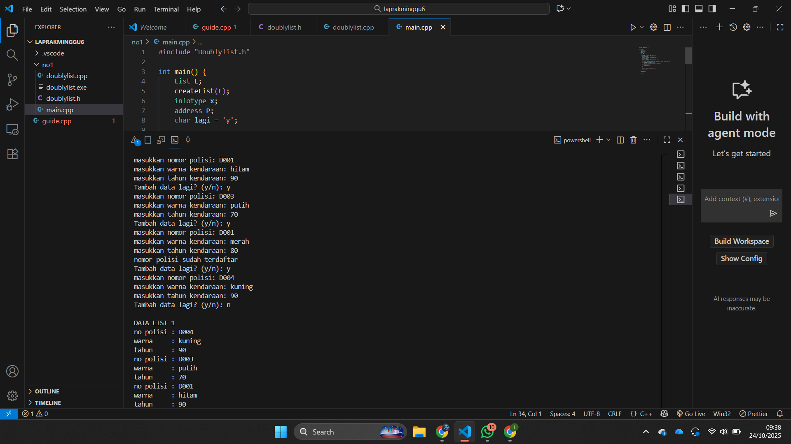

# <h1 align="center">Laporan Praktikum Modul 6 <br> Doubly Linked List (Bagian Pertama)</h1>
<p align="center">Zaki Hamdani - 103112400089</p>

## Dasar Teori

Doubly Linked List adalah struktur data yang terdiri dari rangkaian elemen (node) yang saling terhubung melalui dua pointer, yaitu `next` untuk menunjuk ke elemen berikutnya dan `prev` untuk menunjuk ke elemen sebelumnya, sehingga memungkinkan traversal data secara maju dan mundur. Struktur ini memiliki dua penunjuk utama, yaitu `first` yang menunjuk ke elemen pertama dan `last` yang menunjuk ke elemen terakhir. Dengan adanya dua arah hubungan antar node, operasi seperti penyisipan, penghapusan, pencarian, dan pembaruan data dapat dilakukan lebih fleksibel dibandingkan dengan Singly Linked List, meskipun membutuhkan memori lebih besar karena setiap node menyimpan dua pointer.

## Guide

```go

```


## Unguide

### Soal 1

## doublylist.h
```go
#ifndef DOUBLYLIST_H
#define DOUBLYLIST_H

#include <iostream>
#include <string>
using namespace std;

struct kendaraan {
    string nopol;
    string warna;
    int thnBuat;
};

typedef kendaraan infotype;
typedef struct ElmList *address;

struct ElmList {
    infotype info;
    address next;
    address prev;
};

struct List {
    address first;
    address last;
};

// --- Deklarasi Prosedur/Fungsi ---
void createList(List &L);
address alokasi(infotype x);
void dealokasi(address &P);
void insertLast(List &L, address P);
void printInfo(List L);
address findElm(List L, string nopol);

#endif
```

## doublylist.cpp

```go
#include "Doublylist.h"

void createList(List &L) {
    L.first = NULL;
    L.last = NULL;
}

address alokasi(infotype x) {
    address P = new ElmList;
    P->info = x;
    P->next = NULL;
    P->prev = NULL;
    return P;
}

void dealokasi(address &P) {
    delete P;
    P = NULL;
}

void insertLast(List &L, address P) {
    if (L.first == NULL) {
        L.first = P;
        L.last = P;
    } else {
        L.last->next = P;
        P->prev = L.last;
        L.last = P;
    }
}

void printInfo(List L) {
    address P = L.last;
    int i = 1;
    cout << "\nDATA LIST " << i << endl;
    while (P != NULL) {
        cout << "no polisi : " << P->info.nopol << endl;
        cout << "warna     : " << P->info.warna << endl;
        cout << "tahun     : " << P->info.thnBuat << endl;
        P = P->prev;
    }
}

address findElm(List L, string nopol) {
    address P = L.first;
    while (P != NULL) {
        if (P->info.nopol == nopol) {
            return P;
        }
        P = P->next;
    }
    return NULL;
}
```

## main.cpp

```go
#include "Doublylist.h"

int main() {
    List L;
    createList(L);
    infotype x;
    address P;
    string nopolCari;
    char lagi = 'y';

    while (lagi == 'y' || lagi == 'Y') {
        cout << "masukkan nomor polisi: ";
        cin >> x.nopol;

        if (findElm(L, x.nopol) != NULL) {
            cout << "nomor polisi sudah terdaftar\n";
        } else {
            cout << "masukkan warna kendaraan: ";
            cin >> x.warna;
            cout << "masukkan tahun kendaraan: ";
            cin >> x.thnBuat;

            P = alokasi(x);
            insertLast(L, P);
        }

        cout << "Tambah data lagi? (y/n): ";
        cin >> lagi;
    }

    printInfo(L);

    return 0;
}
```

> Output
> 

Program ini merupakan implementasi struktur data **Doubly Linked List** untuk menyimpan data kendaraan yang terdiri dari nomor polisi, warna, dan tahun pembuatan. Setiap data disimpan dalam node yang memiliki dua pointer (`next` dan `prev`) sehingga dapat ditelusuri maju dan mundur. Program memungkinkan pengguna menambahkan data kendaraan baru ke dalam list, namun terlebih dahulu memeriksa apakah nomor polisi sudah terdaftar menggunakan fungsi pencarian. Jika belum, data dimasukkan di bagian akhir list melalui prosedur `insertLast`. Setelah input selesai, seluruh data kendaraan ditampilkan ke layar dengan menelusuri list dari elemen terakhir ke awal menggunakan prosedur `printInfo`.

## Referensi
1. https://www.w3schools.com/dsa/dsa_theory_linkedlists.php
2. https://www.w3schools.com/dsa/dsa_data_linkedlists_types.php
3. https://www.w3schools.com/dsa/dsa_algo_linkedlists_operations.php
4. https://www.w3schools.com/dsa/dsa_theory_linkedlists_memory.php
5. https://www.w3schools.com/dsa/dsa_examples.php


