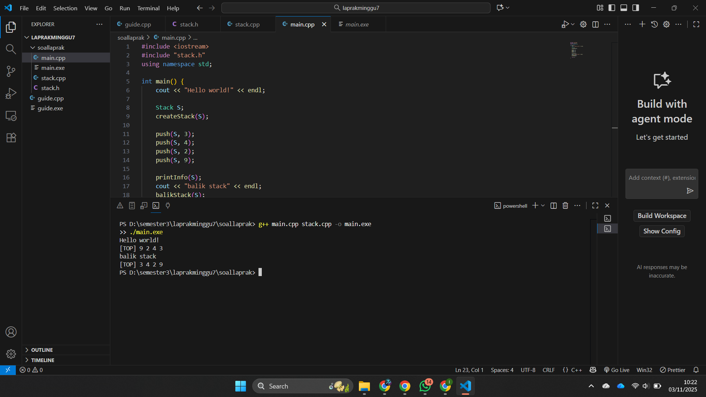
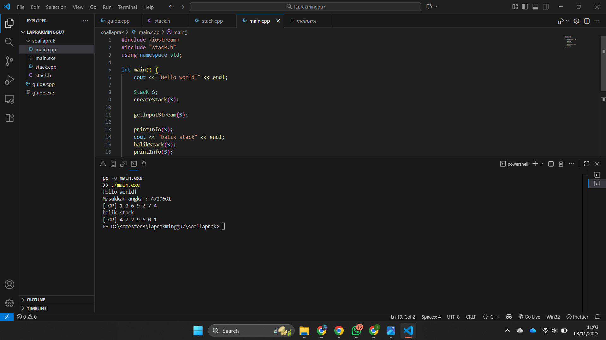

# <h1 align="center">Laporan Praktikum Modul 7 <br> Stack</h1>
<p align="center">Zaki Hamdani - 103112400089</p>

## Dasar Teori


## Guide

```go
#include <iostream>
using namespace std;

struct Node
{
    int data;
    Node *next;
};

bool isEmpety(Node *top)
{
    return top == nullptr;
}

void push(Node *&top, int data){
    Node *newNode = new Node;
    newNode -> data = data;
    newNode -> next = top;
    top = newNode;
}

int pop(Node *&top)
{
    if (isEmpety(top))
    {
        cout << "Stack Kosong, tidak bisa pop!" << endl;
        return 0;
    }

    int poppedData = top -> data;
    top = top -> next;

    Node *temp;
    return poppedData;
}

void show (Node *top)
{
    if (isEmpety(top))
    {
        cout << "Stack kosong," << endl;
        return;
    }
    cout << "TOP -> ";
    Node *temp = top;

    while (temp != nullptr)
    {
        cout << temp->data << "-> ";
        temp = temp->next;
    }

    cout << "NULL" << endl;

}

int main()
{
    Node *stack = nullptr;

    push(stack, 10);
    push(stack, 20);
    push(stack, 30);

    cout << "Menampilkan isi stack:" << endl;
    show (stack);

    cout << "pop;" << pop(stack) << endl;

    cout << "Menampilkan sisa Stack:" << endl;
    show(stack);

    return 0;
}
```


## Unguide

### Soal 1


```go


```

> Output
> 

Program ini

### Soal 2


```go


```

> Output
> 

Program ini

### Soal 3


```go


```

> Output
> 

Program ini 

## Referensi
1. https://www.w3schools.com/dsa/dsa_theory_linkedlists.php
2. https://www.w3schools.com/dsa/dsa_data_linkedlists_types.php
3. https://www.w3schools.com/dsa/dsa_algo_linkedlists_operations.php
4. https://www.w3schools.com/dsa/dsa_theory_linkedlists_memory.php
5. https://www.w3schools.com/dsa/dsa_examples.php


