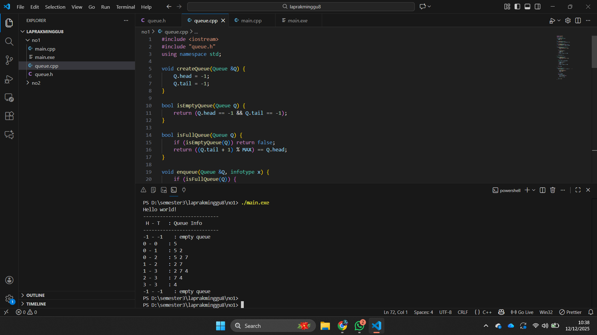

# <h1 align="center">Laporan Praktikum Modul 8 <br> Queue </h1>
<p align="center">Zaki Hamdani - 103112400089</p>

## Dasar Teori

Queue adalah salah satu struktur data linear yang bekerja dengan prinsip **FIFO (First In First Out)**, yaitu elemen yang pertama masuk akan menjadi elemen yang pertama keluar. Konsep ini menyerupai antrean di kehidupan nyata, seperti antrean di loket tiket, di mana orang yang datang lebih dahulu akan dilayani terlebih dahulu. Queue dapat diimplementasikan menggunakan **linked list** maupun **array**, dengan dua operasi utama yaitu **Enqueue** (penyisipan elemen pada bagian belakang/Tail) dan **Dequeue** (penghapusan elemen pada bagian depan/Head). Pada implementasi berbasis linked list, proses insert dan delete lebih efisien karena tidak memerlukan pergeseran elemen. Sementara itu, pada implementasi berbasis array terdapat beberapa variasi, seperti representasi sederhana dengan pergeseran elemen, representasi Head–Tail yang bergerak, hingga model **circular buffer** yang lebih efisien dalam penggunaan memori. Queue banyak digunakan dalam sistem antrian, penjadwalan proses, komunikasi data, serta berbagai algoritma komputasi lainnya.


## Guide

```go
#include <iostream>
using namespace std;

// ukuran maksimal queue
#define MAX 5

// struktur queue
struct Queue {
   // datanya pake array yaa, bukan linked list
   int data[MAX];
   int head;
   int tail;
};

// membuat antrian kosong
void buat_queue (Queue &Q) {
   Q.head = -1;
   Q.tail = -1;
   // kenapa head dan tail-nya -1?
   // karena index array mulai dari 0
}

// cek queueu-nya kosong ngga?
bool cek_kosong (Queue Q) {
   return (Q.head == -1 && Q.tail == -1);
}

// cek queue-nya penuh ngga?
bool cek_penuh (Queue Q) {
   return (Q.tail == MAX - 1);
}

// menampilkan isi queue
void print_queue (Queue Q) {
   if (cek_kosong(Q)) {
      cout << "queue kosong" << endl;
   } else {
      cout << "queue : ";
      for (int i = Q.head; i <= Q.tail; i++) {
         cout << Q.data[i] << " -> ";
      }
      cout << endl;
   }
}

// menambahkan elemen (enqueue)
void enqueue (Queue &Q, int x) {
   if (cek_penuh(Q)) {
      cout << "queue sudah penuh, tidak bisa menambah data" << endl;
   } else {
      if (cek_kosong(Q)) {
         Q.head = Q.tail = 0;
      } else {
         Q.tail++;
      }

      Q.data[Q.tail] = x;
      cout << "menambahkan " << x << " ke dalam queue" << endl;
   }
}

// menghapus elemen (dequeue)
void dequeue (Queue &Q) {
   if (cek_kosong(Q)) {
      cout << "queue kosong, tidak ada yang bisa dihapus" << endl;
   } else {
      cout << "dequeue " << Q.data[Q.head] << " dari dalam queue" << endl;

      // jika hanya ada 1 elemen
      if (Q.head == Q.tail) {
         Q.head = Q.tail = -1;
      } else {
         // geser semua elemen ke depan/kiri
         // biar tempat kosong di depan dipenuhin
         // dan tempat di belakang bisa dikosongin
         for (int i = Q.head; i < Q.tail; i++) {
            Q.data[i] = Q.data[i + 1];
         }

         Q.tail--;
      }
   }
}

// eksekutor
int main() {
   Queue Q;
   buat_queue(Q);

   enqueue(Q, 5);
   enqueue(Q, 2);
   enqueue(Q, 7);
   print_queue(Q);

   dequeue(Q);
   print_queue(Q);

   enqueue(Q, 4);
   enqueue(Q, 9);
   print_queue(Q);

   dequeue(Q);
   dequeue(Q);
   print_queue(Q);

   return 0;
}
```


## Unguide

### Soal 1
> 

## queue.h
```go
#ifndef QUEUE_H
#define QUEUE_H

const int MAX = 5;

typedef int infotype;

struct Queue {
    infotype info[MAX];
    int head;
    int tail;
};

void createQueue(Queue &Q);
bool isEmptyQueue(Queue Q);
bool isFullQueue(Queue Q);
void enqueue(Queue &Q, infotype x);
infotype dequeue(Queue &Q);
void printInfo(Queue Q);

#endif
```

## queue.cpp

```go
#include <iostream>
#include <iomanip>
#include "queue.h"
using namespace std;

void createQueue(Queue &Q) {
    Q.head = -1;
    Q.tail = -1;
}

bool isEmptyQueue(Queue Q) {
    return (Q.head == -1 && Q.tail == -1);
}

bool isFullQueue(Queue Q) {
    return (Q.tail == MAX - 1);
}

void enqueue(Queue &Q, infotype x) {
    if (isFullQueue(Q)) {
        cout << "Queue penuh" << endl;
    } else {
        if (isEmptyQueue(Q)) {
            Q.head = 0;
            Q.tail = 0;
        } else {
            Q.tail++;
        }
        Q.info[Q.tail] = x;
    }
}

infotype dequeue(Queue &Q) {
    if (isEmptyQueue(Q)) {
        return -1;
    }

    infotype temp = Q.info[Q.head];

    if (Q.head == Q.tail) {
        Q.head = -1;
        Q.tail = -1;
    } else {
        for (int i = 0; i < Q.tail; i++) {
            Q.info[i] = Q.info[i + 1];
        }
        Q.tail--;
    }

    return temp;
}

void printInfo(Queue Q) {
    cout << setw(2) << Q.head << " - " << setw(2) << Q.tail;
    cout << "   :   ";

    if (isEmptyQueue(Q)) {
        cout << "empty queue";
    } else {
        for (int i = Q.head; i <= Q.tail; i++) {
            cout << Q.info[i] << " ";
        }
    }
    cout << endl;
}
```

## main.cpp

```go
#include <iostream>
#include "queue.h"
using namespace std;

int main() {
    cout << "Hello world!" << endl;
    cout << "---------------------------" << endl;
    cout << " H - T   : Queue Info" << endl;
    cout << "---------------------------" << endl;

    Queue Q;
    createQueue(Q);

    printInfo(Q);
    enqueue(Q, 5); printInfo(Q);
    enqueue(Q, 2); printInfo(Q);
    enqueue(Q, 7); printInfo(Q);
    dequeue(Q);    printInfo(Q);
    enqueue(Q, 4); printInfo(Q);
    dequeue(Q);    printInfo(Q);
    dequeue(Q);    printInfo(Q);
    dequeue(Q);    printInfo(Q);

    return 0;
}
```

> Output
> 

Program ini merupakan implementasi struktur data **Queue berbasis array dengan mekanisme Alternatif 1**, yaitu *head diam dan tail bergerak*, sehingga elemen baru selalu ditambahkan di bagian belakang (enqueue) dan elemen pertama dihapus dari bagian depan (dequeue). Pada saat dequeue, semua elemen digeser satu posisi ke kiri untuk mempertahankan head tetap di indeks 0. Program terdiri dari tiga file: `queue.h` yang mendefinisikan struktur dan prototipe fungsi, `queue.cpp` yang berisi implementasi operasi queue seperti pengecekan kosong/penuh, enqueue, dequeue, serta fungsi untuk menampilkan isi queue, dan `main.cpp` yang mengeksekusi berbagai operasi enqueue dan dequeue sambil menampilkan perubahan kondisi queue di setiap langkah. Hasil akhirnya memperlihatkan bagaimana antrean berubah sesuai prinsip **FIFO (First In First Out)**, hingga akhirnya kembali menjadi queue kosong.

### Soal 2
Buatlah implementasi ADT Queue pada file “queue.cpp” dengan menerapkan mekanisme
queue Alternatif 2 (head bergerak, tail bergerak).

## queue.cpp
```go
#include <iostream>
#include "queue.h"
using namespace std;

void createQueue(Queue &Q) {
    Q.head = -1;
    Q.tail = -1;
}

bool isEmptyQueue(Queue Q) {
    return (Q.head == -1 && Q.tail == -1);
}

bool isFullQueue(Queue Q) {
    return (Q.tail == MAX - 1);  
    //// PERUBAHAN: pada alternatif 2, queue penuh hanya ketika tail mencapai batas array
}

void enqueue(Queue &Q, infotype x) {
    if (isFullQueue(Q)) {
        cout << "Queue penuh" << endl;
    } 
    else {
        if (isEmptyQueue(Q)) {
            Q.head = 0;
            Q.tail = 0;
            //// PERUBAHAN: head = 0 dan tail = 0 saat queue awalnya kosong
        } 
        else {
            Q.tail++;  
            //// PERUBAHAN: TAIL bergerak maju tanpa menggeser elemen (tidak seperti alternatif 1)
        }
        Q.info[Q.tail] = x;  
    }
}

infotype dequeue(Queue &Q) {
    if (isEmptyQueue(Q)) {
        cout << "Queue kosong" << endl;
        return -1;
    }

    infotype temp = Q.info[Q.head];

    if (Q.head == Q.tail) {
        Q.head = -1;
        Q.tail = -1;
        //// PERUBAHAN: reset ke kondisi kosong jika elemen tinggal 1
    } 
    else {
        Q.head++;  
        //// PERUBAHAN PALING PENTING:
        //// Pada Alternatif 2, HEAD bergerak maju.
        //// Tidak ada pergeseran array seperti Alternatif 1.
    }

    return temp;
}

void printInfo(Queue Q) {
    cout << Q.head << " - " << Q.tail << "    : ";

    if (isEmptyQueue(Q)) {
        cout << "empty queue";
    } 
    else {
        for (int i = Q.head; i <= Q.tail; i++) {
            cout << Q.info[i] << " ";  
            //// PERUBAHAN: printing mengikuti posisi head & tail yang bergerak
        }
    }
    cout << endl;
}
```

> Output
> 

Pada mekanisme **Queue Alternatif 2**, pergerakan antrean diatur dengan memindahkan posisi **head** dan **tail** tanpa menggeser isi array, sehingga operasi menjadi lebih efisien dibanding Alternatif 1. Saat melakukan **enqueue**, nilai baru ditambahkan ke indeks setelah tail dan tail bergerak maju satu posisi; sedangkan head tetap berada pada posisi terakhir elemen yang belum dihapus. Pada operasi **dequeue**, tidak ada penggeseran elemen, namun **head maju satu langkah** untuk menunjuk ke elemen berikutnya, dan jika head dan tail menjadi sama, queue dianggap kembali kosong dan keduanya diset ke `-1`. Implementasi ini memperlihatkan bagaimana antrean tetap mengikuti prinsip **FIFO**, tetapi dengan pengelolaan indeks yang lebih hemat waktu karena tidak perlu melakukan shifting data setiap kali penghapusan.

### Soal 3
Buatlah implementasi ADT Queue pada file “queue.cpp” dengan menerapkan mekanisme
queue Alternatif 3 (head dan tail berputar).

## queue.cpp
```go
#include <iostream>
#include "queue.h"
using namespace std;

void createQueue(Queue &Q) {
    Q.head = -1;
    Q.tail = -1;
}

bool isEmptyQueue(Queue Q) {
    return (Q.head == -1 && Q.tail == -1);
}

bool isFullQueue(Queue Q) {
    if (isEmptyQueue(Q)) return false;
    return ((Q.tail + 1) % MAX) == Q.head;
}

void enqueue(Queue &Q, infotype x) {
    if (isFullQueue(Q)) {
        cout << "Queue penuh" << endl;
        return;
    }

    if (isEmptyQueue(Q)) {
        Q.head = 0;
        Q.tail = 0;
    } else {
        Q.tail = (Q.tail + 1) % MAX;
    }

    Q.info[Q.tail] = x;
}

infotype dequeue(Queue &Q) {
    if (isEmptyQueue(Q)) {
        cout << "Queue kosong" << endl;
        return -1;
    }

    infotype temp = Q.info[Q.head];

    if (Q.head == Q.tail) {
        Q.head = -1;
        Q.tail = -1;
    } else {
        Q.head = (Q.head + 1) % MAX;
    }

    return temp;
}

void printInfo(Queue Q) {
    cout << Q.head << " - " << Q.tail << "    : ";

    if (isEmptyQueue(Q)) {
        cout << "empty queue";
        cout << endl;
        return;
    }

    int i = Q.head;
    while (true) {
        cout << Q.info[i];
        if (i == Q.tail) break;
        cout << " ";
        i = (i + 1) % MAX;
    }

    cout << endl;
}
```

> Output
> 

Pada mekanisme **Queue Alternatif 3**, antrean diimplementasikan sebagai **circular buffer**, di mana posisi **head** dan **tail** bergerak secara melingkar menggunakan operasi modulo sehingga indeks akan kembali ke awal ketika mencapai batas array. Pada saat **enqueue**, tail maju satu langkah secara melingkar untuk menempatkan elemen baru, dan queue dianggap penuh jika posisi setelah tail kembali bertemu dengan head. Saat **dequeue**, head maju satu langkah secara melingkar untuk mengambil elemen berikutnya, dan jika head dan tail menjadi sama, queue kembali kosong dan kedua indeks diset ke `-1`. Pendekatan ini sangat efisien karena tidak pernah melakukan shifting elemen seperti pada Alternatif 1 dan tidak menyisakan ruang kosong tidak terpakai seperti pada Alternatif 2, sehingga memaksimalkan penggunaan memori array dengan tetap mempertahankan prinsip FIFO.


## Referensi
1. https://www.w3schools.com/cpp/cpp_queues.asp
2. https://www.w3schools.com/dsa/dsa_data_queues.php
3. https://www.w3schools.com/cpp/cpp_data_structures.asp
4. https://www.w3schools.com/cpp/exercise.asp?x=xrcise_queues1
5. https://www.w3schools.com/dsa/dsa_intro.php
6. https://www.w3schools.com/dsa/dsa_data_structures.php


