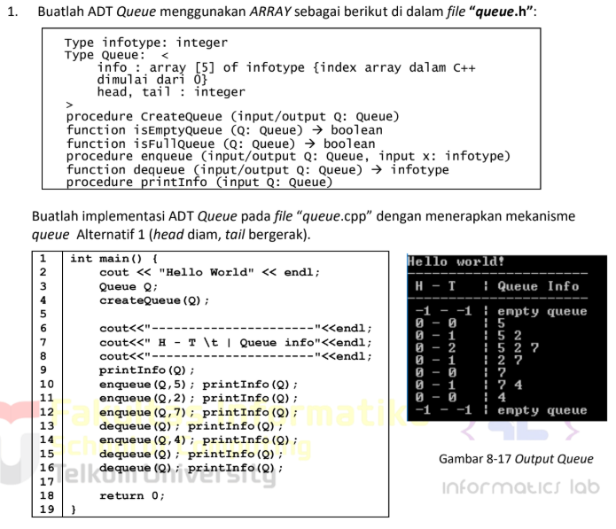
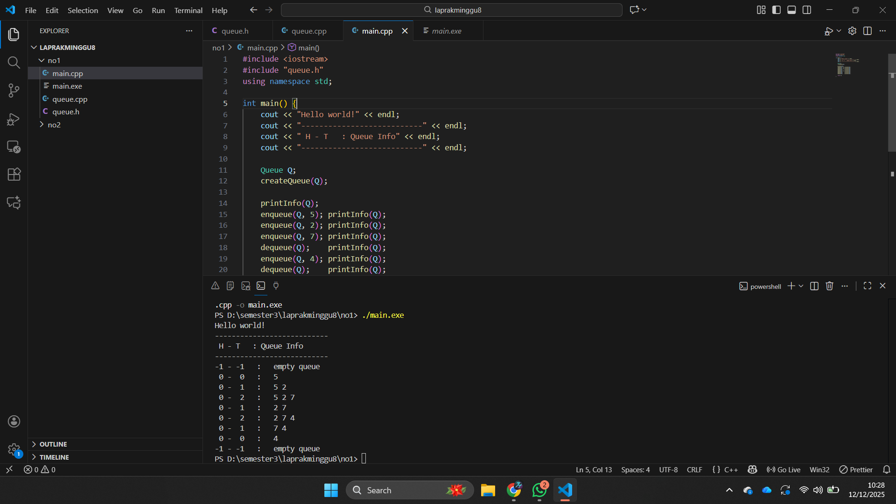

# <h1 align="center">Laporan Praktikum Modul 8 <br> Queue </h1>
<p align="center">Zaki Hamdani - 103112400089</p>

## Dasar Teori

Queue adalah salah satu struktur data linear yang bekerja dengan prinsip **FIFO (First In First Out)**, yaitu elemen yang pertama masuk akan menjadi elemen yang pertama keluar. Konsep ini menyerupai antrean di kehidupan nyata, seperti antrean di loket tiket, di mana orang yang datang lebih dahulu akan dilayani terlebih dahulu. Queue dapat diimplementasikan menggunakan **linked list** maupun **array**, dengan dua operasi utama yaitu **Enqueue** (penyisipan elemen pada bagian belakang/Tail) dan **Dequeue** (penghapusan elemen pada bagian depan/Head). Pada implementasi berbasis linked list, proses insert dan delete lebih efisien karena tidak memerlukan pergeseran elemen. Sementara itu, pada implementasi berbasis array terdapat beberapa variasi, seperti representasi sederhana dengan pergeseran elemen, representasi Head–Tail yang bergerak, hingga model **circular buffer** yang lebih efisien dalam penggunaan memori. Queue banyak digunakan dalam sistem antrian, penjadwalan proses, komunikasi data, serta berbagai algoritma komputasi lainnya.


## Guide

```go
#include <iostream>
using namespace std;

// ukuran maksimal queue
#define MAX 5

// struktur queue
struct Queue {
   // datanya pake array yaa, bukan linked list
   int data[MAX];
   int head;
   int tail;
};

// membuat antrian kosong
void buat_queue (Queue &Q) {
   Q.head = -1;
   Q.tail = -1;
   // kenapa head dan tail-nya -1?
   // karena index array mulai dari 0
}

// cek queueu-nya kosong ngga?
bool cek_kosong (Queue Q) {
   return (Q.head == -1 && Q.tail == -1);
}

// cek queue-nya penuh ngga?
bool cek_penuh (Queue Q) {
   return (Q.tail == MAX - 1);
}

// menampilkan isi queue
void print_queue (Queue Q) {
   if (cek_kosong(Q)) {
      cout << "queue kosong" << endl;
   } else {
      cout << "queue : ";
      for (int i = Q.head; i <= Q.tail; i++) {
         cout << Q.data[i] << " -> ";
      }
      cout << endl;
   }
}

// menambahkan elemen (enqueue)
void enqueue (Queue &Q, int x) {
   if (cek_penuh(Q)) {
      cout << "queue sudah penuh, tidak bisa menambah data" << endl;
   } else {
      if (cek_kosong(Q)) {
         Q.head = Q.tail = 0;
      } else {
         Q.tail++;
      }

      Q.data[Q.tail] = x;
      cout << "menambahkan " << x << " ke dalam queue" << endl;
   }
}

// menghapus elemen (dequeue)
void dequeue (Queue &Q) {
   if (cek_kosong(Q)) {
      cout << "queue kosong, tidak ada yang bisa dihapus" << endl;
   } else {
      cout << "dequeue " << Q.data[Q.head] << " dari dalam queue" << endl;

      // jika hanya ada 1 elemen
      if (Q.head == Q.tail) {
         Q.head = Q.tail = -1;
      } else {
         // geser semua elemen ke depan/kiri
         // biar tempat kosong di depan dipenuhin
         // dan tempat di belakang bisa dikosongin
         for (int i = Q.head; i < Q.tail; i++) {
            Q.data[i] = Q.data[i + 1];
         }

         Q.tail--;
      }
   }
}

// eksekutor
int main() {
   Queue Q;
   buat_queue(Q);

   enqueue(Q, 5);
   enqueue(Q, 2);
   enqueue(Q, 7);
   print_queue(Q);

   dequeue(Q);
   print_queue(Q);

   enqueue(Q, 4);
   enqueue(Q, 9);
   print_queue(Q);

   dequeue(Q);
   dequeue(Q);
   print_queue(Q);

   return 0;
}
```


## Unguide

### Soal 1
> 

## queue.h
```go
#ifndef QUEUE_H
#define QUEUE_H

const int MAX = 5;

typedef int infotype;

struct Queue {
    infotype info[MAX];
    int head;
    int tail;
};

void createQueue(Queue &Q);
bool isEmptyQueue(Queue Q);
bool isFullQueue(Queue Q);
void enqueue(Queue &Q, infotype x);
infotype dequeue(Queue &Q);
void printInfo(Queue Q);

#endif
```

## queue.cpp

```go
#include <iostream>
#include <iomanip>
#include "queue.h"
using namespace std;

void createQueue(Queue &Q) {
    Q.head = -1;
    Q.tail = -1;
}

bool isEmptyQueue(Queue Q) {
    return (Q.head == -1 && Q.tail == -1);
}

bool isFullQueue(Queue Q) {
    return (Q.tail == MAX - 1);
}

void enqueue(Queue &Q, infotype x) {
    if (isFullQueue(Q)) {
        cout << "Queue penuh" << endl;
    } else {
        if (isEmptyQueue(Q)) {
            Q.head = 0;
            Q.tail = 0;
        } else {
            Q.tail++;
        }
        Q.info[Q.tail] = x;
    }
}

infotype dequeue(Queue &Q) {
    if (isEmptyQueue(Q)) {
        return -1;
    }

    infotype temp = Q.info[Q.head];

    if (Q.head == Q.tail) {
        Q.head = -1;
        Q.tail = -1;
    } else {
        for (int i = 0; i < Q.tail; i++) {
            Q.info[i] = Q.info[i + 1];
        }
        Q.tail--;
    }

    return temp;
}

void printInfo(Queue Q) {
    cout << setw(2) << Q.head << " - " << setw(2) << Q.tail;
    cout << "   :   ";

    if (isEmptyQueue(Q)) {
        cout << "empty queue";
    } else {
        for (int i = Q.head; i <= Q.tail; i++) {
            cout << Q.info[i] << " ";
        }
    }
    cout << endl;
}
```

## main.cpp

```go
#include <iostream>
#include "queue.h"
using namespace std;

int main() {
    cout << "Hello world!" << endl;
    cout << "---------------------------" << endl;
    cout << " H - T   : Queue Info" << endl;
    cout << "---------------------------" << endl;

    Queue Q;
    createQueue(Q);

    printInfo(Q);
    enqueue(Q, 5); printInfo(Q);
    enqueue(Q, 2); printInfo(Q);
    enqueue(Q, 7); printInfo(Q);
    dequeue(Q);    printInfo(Q);
    enqueue(Q, 4); printInfo(Q);
    dequeue(Q);    printInfo(Q);
    dequeue(Q);    printInfo(Q);
    dequeue(Q);    printInfo(Q);

    return 0;
}
```

> Output
> 

Program ini merupakan implementasi struktur data **Doubly Linked List** untuk menyimpan data kendaraan yang terdiri dari nomor polisi, warna, dan tahun pembuatan. Setiap data disimpan dalam node yang memiliki dua pointer (`next` dan `prev`) sehingga dapat ditelusuri maju dan mundur. Program memungkinkan pengguna menambahkan data kendaraan baru ke dalam list, namun terlebih dahulu memeriksa apakah nomor polisi sudah terdaftar menggunakan fungsi pencarian. Jika belum, data dimasukkan di bagian akhir list melalui prosedur `insertLast`. Setelah input selesai, seluruh data kendaraan ditampilkan ke layar dengan menelusuri list dari elemen terakhir ke awal menggunakan prosedur `printInfo`.

## Referensi
1. https://www.w3schools.com/dsa/dsa_theory_linkedlists.php
2. https://www.w3schools.com/dsa/dsa_data_linkedlists_types.php
3. https://www.w3schools.com/dsa/dsa_algo_linkedlists_operations.php
4. https://www.w3schools.com/dsa/dsa_theory_linkedlists_memory.php
5. https://www.w3schools.com/dsa/dsa_examples.php


